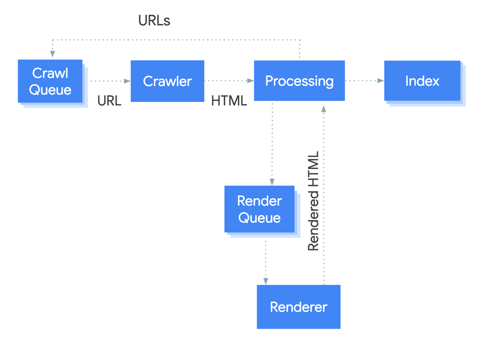
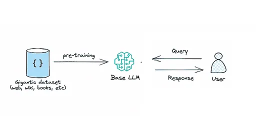
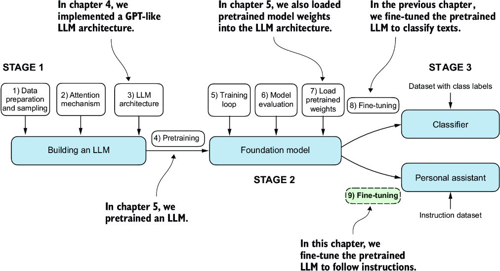

## 1.🧠Does ChatGPT Know or Does It Guess?

ChatGPT does not `know` things in exactly the same way humans know them. It generates answers by predicting what tokens are most likely to come next, based on patterns learned during training and the context of the conversation.

But saying _ChatGPT just guesses_ is also too simple. It is doing much more than random guessing.

### 1. First, what does `know` mean?

When we say a human knows something, usually we mean :

- We have learned some information.
- We can remember it.
- We understand relationships b/w things.
- We can use that knowledge in a new situation.
- We can sometimes verify whether something is true.

**For Example:**

What is the capital of India?

    A human may answer:  New Delhi

The human has a mental representation of India, cities, geography, etc. But ChatGPT doesn't store knowledge in its brain in exactly this human-like form.

### 2. So does ChatGPT `guess`?

In one important sense, yes. At its core, an [LLM](../episode-02/README.md) generates text by predicting the next [token](../episode-02/README.md).

**For Example:**

    The capital of india is ____

The model may assign high probability to:

    New

Then:

    The capital of India is New ______

It predicts:

    Delhi

So the generated sentence is:

    The capital of India is New Delhi

<div align="center">🔍We will discuss Token Prediction in more depth later</div>

---
### 3. But this is NOT random guessing

This is the most important distinction.

Imagine I ask you:

> Complete this sentence:


```
The sun rises in the ______.
```

You will probably say:

> east

You are not randomly guessing.

You are using:

-  knowledge 
-  experience 
-  language patterns 
-  relationships between concepts 

Similarly, an LLM has learned enormous numbers of patterns from its training data.

So instead of:


```
Random Guess
```

it is more like:


```
Learned Patterns
       +
Current Context
       +
Previous Tokens
       +
Model Computation
       ↓
Probability Distribution
       ↓
Next Token
```

---

### 4. What does the model actually predict?

It predicts **tokens**, not complete answers.

Suppose we ask:

> Why is the sky blue?

The model doesn't necessarily think:

> "I know the complete answer. Now I will retrieve it."

Instead, generation happens step by step.

Conceptually:


```
Why
 ↓
Why is
 ↓
Why is the
 ↓
Why is the sky
 ↓
Why is the sky blue
 ↓
Why is the sky blue?
 ↓
Because
 ↓
Because sunlight
 ↓
Because sunlight contains
 ↓
...
```

Each generated token changes the context for the next prediction.

---

### 5. Then how can ChatGPT give factual answers?

This is where things become interesting.

During training, the model processes huge amounts of text.

It learns statistical relationships such as:


```
India → New Delhi
Python → programming language
Transformer → attention
Earth → planet
2 + 2 → 4
```

But it isn't simply storing a giant dictionary like:


```
Question → Answer
```

Instead, information becomes distributed across the model's learned parameters.

Very simplified:


```
Training Data
     ↓
Patterns
     ↓
Neural Network Training
     ↓
Learned Parameters
     ↓
Model
     ↓
Generate Responses
```

These learned parameters contain information about relationships between concepts, language patterns, facts, styles, and much more.

---

### 6. Think about it like a very powerful pattern learner

Suppose during training the model sees:


```
The capital of France is Paris.
```

many times and in many contexts.

It learns relationships between:


```
France
   ↕
Capital
   ↕
Paris
```

Later you ask:

> What is the capital of France?

The context strongly activates the learned relationship.

The model generates:

> Paris.

So from outside it looks like:


```
Question → Knowledge → Answer
```

But internally it is closer to:


```
Question
   ↓
Token representation
   ↓
Neural network computation
   ↓
Learned representations
   ↓
Probability distribution
   ↓
Next token
```

---

### 7. Why does this sometimes produce wrong answers?

This is one of the biggest problems with LLMs.

Suppose you ask:

> Who invented a fictional technology called XYZ in 1842?

If the model doesn't have reliable information, it may still generate something that **sounds convincing**.

For example:


```
Question
   ↓
Model searches learned patterns
   ↓
No reliable information
   ↓
Similar patterns found
   ↓
Generate plausible continuation
   ↓
Confident-sounding answer
```

This is commonly called a **hallucination**.

The important point is:

> **The model is optimized to generate useful and likely text, not to automatically guarantee that every statement is factually true.**

---

### 8. This creates an important difference

A language model can produce:

#### Correct answer


```
2 + 2 = 4
```

#### Incorrect answer


```
2 + 2 = 5
```

#### Plausible but completely invented answer


```
A fictional scientist invented XYZ technology in 1842.
```

The model can generate all three.

Why?

Because its basic generation mechanism is not:


```
Is this statement objectively true?
       ↓
YES → answer
NO  → reject
```

It is fundamentally:


```
Given this context,
what continuation should I generate?
```

Modern systems can add additional mechanisms—such as tools, retrieval, verification, and post-training—to improve factuality and reasoning, but the underlying language-generation process still involves probabilistic token prediction.

---

### 9. Does ChatGPT understand what it is saying?

This question is much harder.

There are two meanings of **understanding**.

#### Human-like understanding

This could mean:

-  consciousness 
-  personal experience 
-  intentions 
-  emotions 
-  subjective awareness 
-  having a mental world 

We should **not assume that ChatGPT has these things** merely because it produces fluent language.

#### Computational understanding

In another sense, the model clearly develops useful internal representations.

For example, it can represent relationships such as:


```
Paris → France
France → Europe
Europe → continent
```

and use those relationships in new contexts.

So it is reasonable to talk about **learned representations and computational understanding**, while being careful not to equate that with human consciousness or human experience.

---

### 10. A useful example

Ask ChatGPT:

> If I have 10 apples and give 3 to my friend, how many are left?

It can answer:


```
10 - 3 = 7
```

Is it "guessing"?

At the token-generation level, yes, it is generating the most appropriate continuation.

But there is more happening.

The model can represent:


```
10
 ↓
quantity

give 3 away
 ↓
subtract 3

10 - 3
 ↓
7
```

So calling this merely:

> "ChatGPT guesses."

doesn't explain the actual system well.

A better statement is:

> **ChatGPT generates answers probabilistically using patterns and representations learned during training, and for some tasks it can perform multi-step computation or reasoning during generation.**

---

### 11. What happens when you ask a difficult question?

Suppose you ask:

> Why does increasing temperature increase the pressure of a gas when volume is constant?

A simplified view is:


```
Question
   ↓
Tokenization
   ↓
Context representation
   ↓
Transformer processing
   ↓
Learned relationships activated
   ↓
Generate explanation
   ↓
Next token
   ↓
Next token
   ↓
Next token
   ↓
Complete answer
```

The model may generate something like:


```
Temperature increases
        ↓
Molecules gain kinetic energy
        ↓
Molecules move faster
        ↓
More energetic collisions
        ↓
More pressure
```

This can look like the model "knows physics."

But technically, the model is generating this explanation using learned representations and computations.

---

### 12. What about reasoning?

This becomes even more interesting.

Earlier, people often described LLMs as:

> **Predict the next token.**

But modern reasoning-oriented models can perform much more complex multi-step computations during generation.

Conceptually:


```
Problem
   ↓
Initial reasoning
   ↓
Intermediate computation
   ↓
Check relationships
   ↓
Continue reasoning
   ↓
Final answer
```

So:


```
Next-token prediction
```

is still fundamental, but **what the model does while producing those tokens can involve complex multi-step reasoning-like computation**.

This is one of the important ideas you'll encounter later in Namaste AI.

---

### 13. Why can it answer questions it has never seen before?

This is where **generalization** becomes important.

Suppose the model learned:


```
A + B = C
```

and learned many mathematical patterns.

You give it a new problem it has never encountered exactly before.

It may still solve it because it has learned broader patterns.

For example:


```
Training examples
       ↓
Learn relationships
       ↓
Learn abstractions
       ↓
New problem
       ↓
Apply learned patterns
       ↓
Generate solution
```

This is different from simply memorizing every question and answer.

---

### 14. Does ChatGPT have a database inside it?

Not in the simple way people often imagine.

You might imagine:


```
             ChatGPT
                │
        ┌───────┴───────┐
        ▼               ▼
   Wikipedia DB      Books DB
        │               │
        └───────┬───────┘
                ▼
             Answer
```

That's not a good mental model of how a language model fundamentally works.

A better simplified picture is:


```
              Training Data
                    │
                    ▼
             Neural Network
                    │
             Training Process
                    │
                    ▼
            Learned Parameters
                    │
                    ▼
                  Model
                    │
                    ▼
             User's Question
                    │
                    ▼
             Model Computation
                    │
                    ▼
             Generated Answer
```

The model's learned parameters encode statistical and semantic relationships rather than functioning as a straightforward searchable document database.

---

### 15. Then what is the role of probability?

Probability is extremely important.

Suppose the model sees:


```
The capital of India is
```

Conceptually, it might assign probabilities like:


```
Delhi      → 0.92
Mumbai     → 0.02
Kolkata    → 0.01
London     → 0.001
...
```

The exact numbers here are only illustrative.

The important idea is:


```
Context
   ↓
Probability distribution over possible next tokens
   ↓
Select/generate token
```

Then the process continues.

---

### 16. This is why wording matters

Compare:


```
The capital of India is
```

with:


```
The largest city in India by population is
```

The context changes.

Therefore the probability distribution changes.


```
Context A
   ↓
Probability Distribution A

Context B
   ↓
Probability Distribution B
```

This is one reason prompts matter so much.

---

### 17. Does temperature affect guessing?

Yes.

A simplified idea is that **temperature changes how strongly the model favors high-probability tokens** during sampling.

Lower temperature:


```
More predictable
More conservative
Less variation
```

Higher temperature:


```
More variation
More diverse
More unpredictable
```

Conceptually:


```
Low temperature
       ↓
High-probability choices dominate


High temperature
       ↓
More possible choices become likely
```

So the generation process can be made more or less random.

---

### 18. Why does ChatGPT sometimes sound very confident when wrong?

This is an important weakness.

The model's objective is not simply:


```
Truth detector
```

It generates language.

So a response can have:


```
High fluency
+
Good grammar
+
Strong confidence
+
Wrong information
```

These are separate properties.

Therefore:

> **Fluent ≠ True**

and:

> **Confident ≠ Correct**

This is one of the most important things to remember when using AI.

---

### 19. Tools can change the situation

Modern AI systems can use external tools.

For example:


```
User Question
      ↓
      AI
      │
      ├── Internal learned knowledge
      │
      ├── Web search
      │
      ├── Calculator
      │
      ├── Code execution
      │
      └── External database
      ↓
Final Answer
```

This is different from relying only on the model's learned parameters.

For example, if you ask for today's stock price, a model shouldn't rely only on what it learned during training.

It needs **current information**.

Similarly, a calculator can provide more reliable arithmetic than asking the model to generate arithmetic purely from learned patterns.

---

### 20. So does ChatGPT know or guess?

The best answer is:

#### ❌ "ChatGPT knows everything."

Wrong.

#### ❌ "ChatGPT just randomly guesses."

Also wrong.

#### ✅ A better explanation

> **ChatGPT generates responses using patterns and representations learned during training. At generation time, it predicts tokens based on the current context and its learned parameters. This prediction is probabilistic, but it is not random guessing. For difficult tasks, the model can perform complex multi-step computations, and external tools can provide additional information or verification.**

---

### 21. The complete mental model

For your Episode 03 blog, I would represent the idea like this:


```
                         TRAINING
                            │
                            ▼
                    Training Data
                            │
                            ▼
                  Neural Network Training
                            │
                            ▼
                   Learned Parameters
                            │
                            ▼
                         MODEL
                            │
                            │
                    ───── INFERENCE ─────
                            │
                            ▼
                      User Prompt
                            │
                            ▼
                     Tokenization
                            │
                            ▼
                 Context Representation
                            │
                            ▼
                Transformer Computation
                            │
                            ▼
               Probability Distribution
                            │
                            ▼
                    Next Token
                            │
                            ▼
                  Add to Context
                            │
                            ▼
                    Predict Next Token
                            │
                         Repeat
                            │
                            ▼
                     Final Response
```

And when tools are available:


```
                         User
                           │
                           ▼
                         Prompt
                           │
                           ▼
                         Model
                           │
              ┌────────────┼────────────┐
              │            │            │
              ▼            ▼            ▼
         Learned       Reasoning      Tools
         Knowledge     / Computation   │
                                      ├─ Web
                                      ├─ Calculator
                                      ├─ Code
                                      └─ Database
              │            │            │
              └────────────┼────────────┘
                           ▼
                     Final Response
```

---

### 22. The most important takeaway

If you remember only **five things** from this question:

1. **ChatGPT doesn't “know” things exactly like a human does.** 
2. **At its core, an LLM predicts the next token based on context and learned parameters.** 
3. **This prediction is probabilistic, but it is not random guessing.** 
4. **The model can generate surprisingly complex answers because it has learned rich patterns and representations and can perform multi-step computation during generation.** 
5. **A fluent answer is not automatically a true answer.** This is why hallucinations, verification, retrieval, tools, and reasoning techniques matter. 

### One-line mental model

> **LLM = learned patterns + context + neural computation + probabilistic token generation**

---

## 2.🔎 Search Engine vs 🤖 LLM

| Aspect                    | Search Engine                                                                     | LLM                                                                              |
| ------------------------- | --------------------------------------------------------------------------------- | -------------------------------------------------------------------------------- |
| **Primary Purpose**       | Finds relevant information from the web                                           | Generates a response based on learned patterns and the given context             |
| **How it works**          | Searches and ranks existing web pages/documents                                   | Predicts and generates text token by token                                       |
| **Source of Information** | Web pages, websites, documents, databases, etc.                                   | Patterns and relationships learned during training + provided context            |
| **Knowledge**             | Retrieves information from available sources                                      | Uses knowledge represented in its learned parameters                             |
| **Real-Time Information** | Can retrieve current information from the web                                     | May not know the latest information unless connected to external tools/data      |
| **Reasoning / Synthesis** | Mainly retrieves and ranks information                                            | Can summarize, explain, compare, transform, and reason over information          |
| **Risk of Hallucination** | Generally returns existing sources, though search results can still be misleading | Can generate plausible but incorrect information                                 |
| **Best Used For**         | Finding current information and original sources                                  | Understanding, explaining, summarizing, generating, and working with information |

---

## 3. How Indexing helps google to rank ?

Google Search works in three stages:

- [**Crawling**](https://youtu.be/JuK7NnfyEuc?si=aG6RKQVTEPatxbD5): Google downloads text, images, and videos from pages it found on the internet with automated programs called crawlers.

- [**Indexing**](https://youtu.be/pe-NSvBTg2o?si=gAIcXNNcxuAlEp6t): Google analyzes the text, images, and video files on the page, and stores the information in the Google index, which is a large database.

- [**Serving search results**](https://youtu.be/lgQazesEjO4?si=US5m-6YoUmp41uhp): When a user searches on Google, Google returns information that's relevant to the user's query.

<p align="center">
  <a href="./images/googlebot-crawl-render-index.png">
    
  </a>
  <p align="center">
    <em>High-level architecture of Google Search</em>
  </p>
</p>


---

## 4. What is knowledge cut-off date ?

Now we have an important question:

> **If ChatGPT learns from training data, does it know everything that happened in the world?**

No.

Every AI model has a **knowledge cutoff** or **knowledge cutoff date**.

The knowledge cutoff is the point in time after which the model's **base training knowledge is not guaranteed to include newly created information**.

In simple words:

> **A knowledge cutoff tells us roughly how far the model's built-in training knowledge goes.**

---

#### 🧠 A Simple Example

Imagine an AI model was trained using information available up to:

```text
December 2024
```

Then imagine these events happen:

```text
January 2025
    ↓
New smartphone released

March 2025
    ↓
New scientific paper published

June 2025
    ↓
New company launched
```

If the model has **no access to external information**, we should not assume that it automatically knows about these events.

The simplified picture is:

```text
                    TRAINING DATA
                         │
                         ▼
                 Information up to
                    Cutoff Date
                         │
                         ▼
                  Model Training
                         │
                         ▼
                  Learned Model
                         │
                         │
                  Knowledge boundary
                         │
                         ▼
                 New information
                 after cutoff
                         │
                         ▼
                 Not guaranteed
                 to be known
```

---

###  Why Does a Knowledge Cutoff Exist?

A model is trained using a large amount of data.

That training process takes:

- Time
- Computing resources
- Data collection
- Data cleaning
- Training
- Evaluation
- Testing
- Safety and quality checks

So training is not like continuously downloading everything from the internet every second.

A simplified process looks like:

```text
Collect Data
     ↓
Clean Data
     ↓
Prepare Training Dataset
     ↓
Train Model
     ↓
Evaluate Model
     ↓
Release Model
```

Once the model is trained, its built-in knowledge does not automatically update every time something new happens in the world.

---

###  Knowledge Cutoff vs Current Information

This distinction is very important.

Suppose:

> Today is 2026.

And a model's base training data only goes up to an earlier period.

There may be information about:

```text
2024
2023
2022
...
```

but new information from:

```text
2025
2026
```

may not be part of the model's original training knowledge.

That does **not** mean the model cannot answer anything about 2025 or 2026.

It means:

> **The model should not automatically be trusted to know new events just because it can talk about them.**

---

## 4. What is Base Model?

A `Base Model` (or Foundation Model) is the result of the pre-training phase. It has consumed terabytes of text and learned a statistical probability distribution. Its only function is: Given a sequence of tokens, predict the next most likely token.

It has no concept of “questions,” “answers,” or “instructions.” It only understands patterns. As a probabilistic engine, it is designed to minimize entropy. It doesn’t know facts other than predicting the most likely next token based on training distribution.

**Example:**

       GPT3, GPT4, BERT

Base Model are great for understanding and predicting language patterns but they don't work well in following instructions provided by prompts. By the way, “Base Model” are called sometimes pre-trained LLMs.

Suppose you prompt the model

``What is the capital of France?``

The model analyzes the pattern. In its training data (internet forums, datasets, books), a list of questions often follows a question. It tries to minimize entropy by generating more questions.

It may then respond

```And what is the population of Paris? What is the French currency?```

We can think of a base model as libc or a massive generic utility library:

It contains all the raw knowledge (functions, symbols, logic).

It has no entry point (`main()` function).

It has no opinion on how it should be used.

### What a Base Model Does?

- **Next-Word prediction**: Trained on books, websites, and articles to guess the next token or word in a sequence.
- **Absorbs Vast Knowledge**: Learns grammar, facts, world history, and basic reasoning patterns from the training data.
- **Acts as a Completion Engine**:  If you prompt it with a question like "What is a recipe for cake?", it might reply by listing more interview questions or recipes instead of answering the query directly. [Resources](https://toloka.ai/blog/base-llm-vs-instruction-tuned-llm/)

<p align="center">
  <a href="./images/basellm.webp">
    
  </a>
  <p align="center">
    <em>Base Model</em>
  </p>
</p>

---

## 4. What is Instruct/Chat Model?
A base model that has undergone extra fine-tuning (using instruction-answer pairs) to behave safely, answer questions, and hold conversations. An Instruction Fine-Tuned (IFT) model is basically a Foundation Model (Base Model) that has gone through Post-Training.
Behind the scene the chat/instruct models are just text-completion models relying on specific markers to annotate which part of the conversation is said by whom.


For example, when you send this JSON array for completion
```json
{
  "messages": [
    {
      "role": "system",
      "content": "You are a helpful assistant."
    },
    {
      "role": "user",
      "content": "Hello!"
    },
    {
      "role": "assistant",
      "content": "Hi! How can I help you today?"
    },
    {
      "role": "user",
      "content": "What's the weather?"
    }
  ]
}
```
It is converted to the following using a template(Jinja)
```text
<|im_start|>system
You are a helpful assistant.<|im_end|>

<|im_start|>user
Hello!<|im_end|>

<|im_start|>assistant
Hi! How can I help you today?<|im_end|>

<|im_start|>user
What's the weather?<|im_start|>assistant
```


 <p align="center">
  <a href="./images/7-1.png">
    
  </a>
  <p align="center">
    <em>Instruct/Chat Model</em>
  </p>
</p>

---

## 5. What is Inference?

It is a live process where a pre-trained Machine Learning examines fresh, unseen data to draw conclusions, make predictions or take action.
It is a operational phase of AI, functioning like a practiced skill put to work in real time.
In the context of LLMs, inference involves taking a user’s input (a prompt) and processing it through the model’s parameters to generate relevant outputs like text, code, or translations.

<p align="center">
  <a href="./images/inference.png">
    
  </a>
  <p align="center">
    <em>Inference Architecture</em>
    
  </p>
</p> 

For example, when you ask an AI assistant a question, the model processes your query token by token, predicting the next likely word or phrase in a sequence based on patterns it learned during training. Unlike training, which is a one-time, resource-intensive process, inference happens repeatedly, often in real-time, as users interact with the model.

---
## 6. What is Hallucination?

`AI hallucination` is when a model produces information that sounds confident and well-structured, but it actually incorrect, fabricated and impossible to verify.
This includes things like made-up fake book references, academic papers, invented historical facts, or technical explanations that look right on the surface but fall apart under real checking.
**The real danger is not that it gets things wrong --- it's that it often gets them wrong in a way that sounds extremely convincing.**  [More Reference](https://openai.com/index/why-language-models-hallucinate/)

> Confidence in language is not confidence of truth.

---

