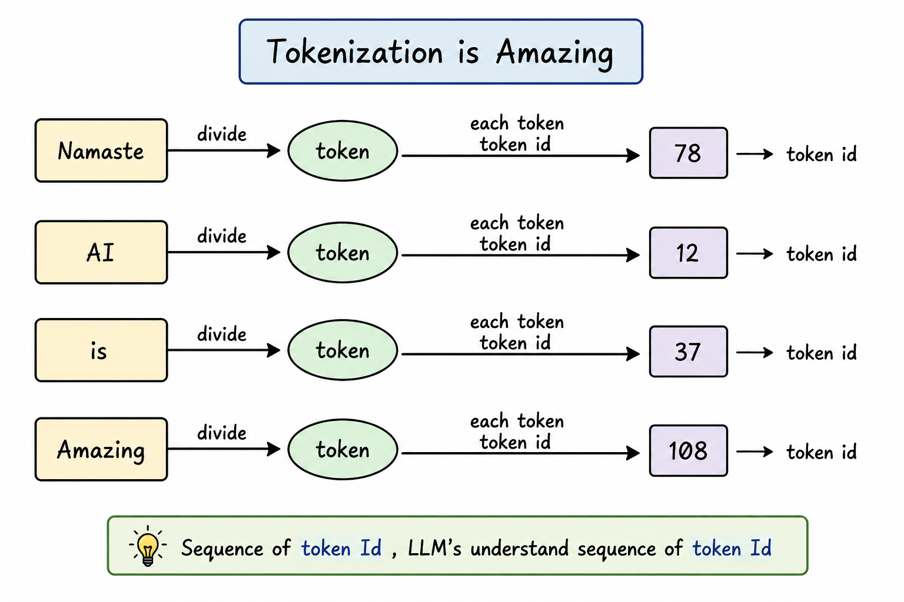
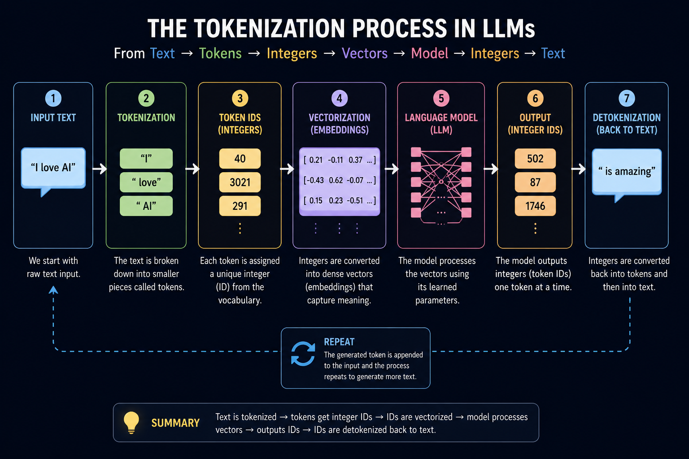
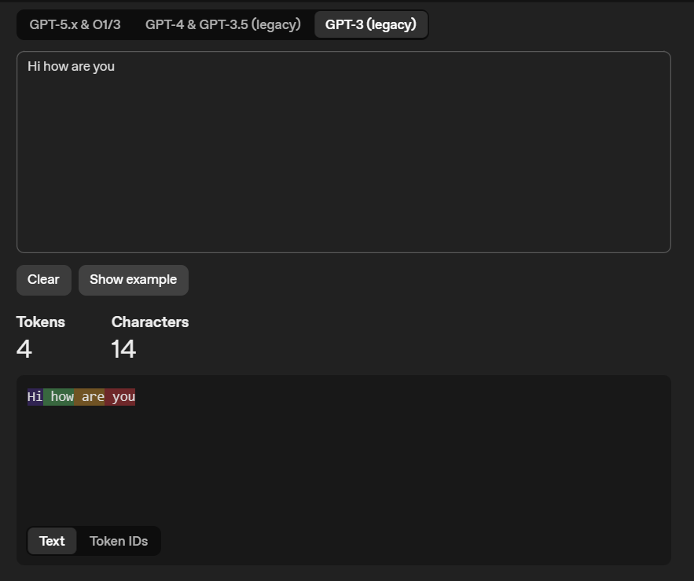
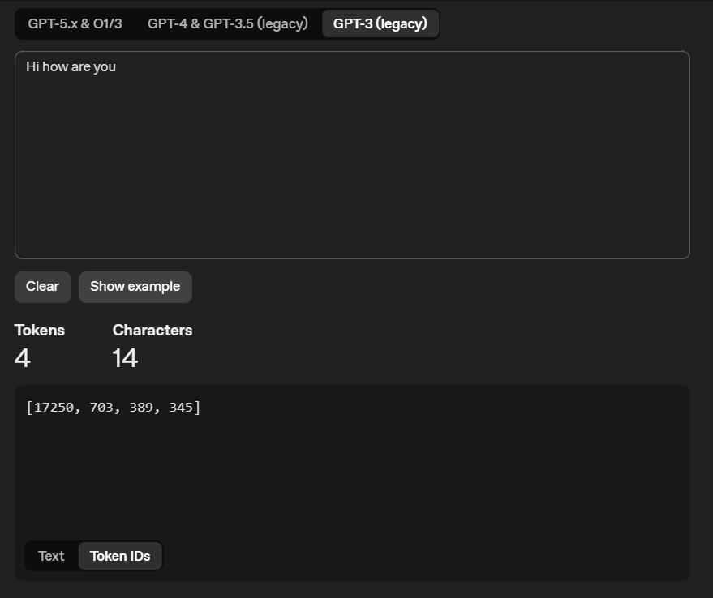
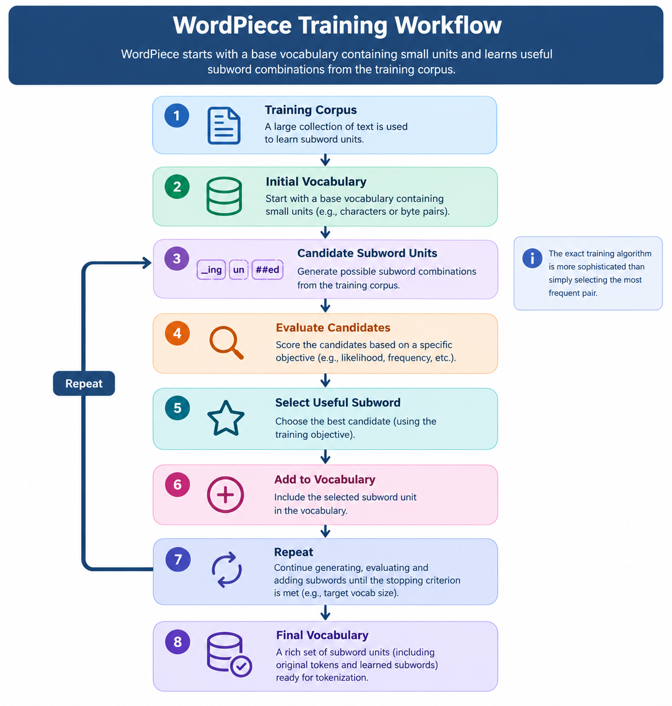

<div align="center">

# The Secret Language of LLMs

</div>


<div style="display: flex; justify-content: space-between;">

<a href="../episode-03/README.md">← Previous Episode</a>
&nbsp;&nbsp;&nbsp;&nbsp;&nbsp;&nbsp;&nbsp;&nbsp;&nbsp;&nbsp;&nbsp;&nbsp;&nbsp;&nbsp;&nbsp;&nbsp;&nbsp;&nbsp;&nbsp;&nbsp;&nbsp;&nbsp;&nbsp;&nbsp;&nbsp;&nbsp;&nbsp;&nbsp;&nbsp;&nbsp;&nbsp;&nbsp;&nbsp;&nbsp;&nbsp;&nbsp;&nbsp;&nbsp;&nbsp;&nbsp;&nbsp;&nbsp;&nbsp;&nbsp;&nbsp;&nbsp;&nbsp;&nbsp;&nbsp;&nbsp;&nbsp;&nbsp;&nbsp;&nbsp;&nbsp;&nbsp;&nbsp;&nbsp;&nbsp;&nbsp;&nbsp;&nbsp;&nbsp;&nbsp;&nbsp;&nbsp;&nbsp;&nbsp;&nbsp;&nbsp;&nbsp;&nbsp;&nbsp;&nbsp;&nbsp;&nbsp;&nbsp;&nbsp;&nbsp;&nbsp;&nbsp;&nbsp;&nbsp;&nbsp;&nbsp;&nbsp;&nbsp;&nbsp;&nbsp;&nbsp;&nbsp;&nbsp;&nbsp;&nbsp;&nbsp;&nbsp;&nbsp;&nbsp;&nbsp;&nbsp;&nbsp;&nbsp;&nbsp;&nbsp;&nbsp;&nbsp;&nbsp;&nbsp;&nbsp;&nbsp;&nbsp;&nbsp;&nbsp;&nbsp;&nbsp;&nbsp;&nbsp;&nbsp;&nbsp;&nbsp;&nbsp;&nbsp;&nbsp;&nbsp;&nbsp;&nbsp;&nbsp;&nbsp;&nbsp;&nbsp;&nbsp;&nbsp;&nbsp;&nbsp;&nbsp;&nbsp;&nbsp;&nbsp;&nbsp;&nbsp;&nbsp;&nbsp;&nbsp;&nbsp;&nbsp;&nbsp;&nbsp;&nbsp;&nbsp;&nbsp;&nbsp;&nbsp;&nbsp;&nbsp;&nbsp;&nbsp;&nbsp;&nbsp;&nbsp;&nbsp;&nbsp;&nbsp;&nbsp;&nbsp;&nbsp;&nbsp;&nbsp;&nbsp;&nbsp;&nbsp;&nbsp;&nbsp;
<a href="../episode-05/README.md">Next Episode →</a>

</div>

---


LLMs basically does not understand words. They turn words into numbers and map them into a giant mathematical space. Sequence of token ID LLMs understand. Spliting words into [token]() is called [tokenization](###-Tokenization).

<p align="center">
  <a href="./images/token.png">
    
  </a>
  <p align="center">
    <em>From Text to Token IDs: How Tokenization Works</em>
  </p>
</p>

## 1. Tokenization

Tokenization is the process of converting text into a sequence of tokens. 

Tokens can be words, subwords or characters. 

Tokens are the smallest meaning of a text that can be processed by a LLM ( Large Language Model ). In the LLM pre-training phase after tokenization each token assigned a unique integer. For each integer, there is a corresponding row in a `lookup table`, which is the vector presentation of that token. 

### Why do we need Tokenization?

Suppose Prakritish want to `pre-train` his own language model. And he have `100 GB` textual data.Main problem is  Language models or any ML models can only process numbers. Here he needs a method to convert his text into numbers. There is where tokenization comes into play. 

To use language model, we'll first tokenize the text.

Then we'll assign each token a unique integer. 

These integers are then vectorized and fed into the language model. 

The language model processes this vectorized input and outputs integers again

which are subsequently converted back into text.

<p align="center">
  <a href="./images/tokenization-pipeline.png">
    
  </a>
  <p align="center">
    <em>Tokenization process in LLMs</em>
  </p>
</p>

Without tokenization, language models would not be able to operate on just raw textual data.

[Play with Tokenizer 🤖](https://platform.openai.com/tokenizer)

<p align="center">
  <a href="./images/live-tokenization-demo1.png">
    
  </a>
  <p align="center">
    <em>Tokenizer</em>
  </p>
</p>

<p align="center">
  <a href="./images/live-tokenization-demo2.png">
    
  </a>
  <p align="center">
    <em>Tokenizer, asign unique integer</em>
  </p>
</p>


## 2. Subword Tokenization

Subword tokenization involves breaking words into smaller, meaningful subword units. This method is useful for handling rare or unknown words by breaking them into subword parts, which are more likely to be part of the model’s vocabulary.

**Example**

- Word: "Untrustable"
- Subword Tokens: ['Un','trust','able']

Subword tokenization is important in Generative model because it allows models to represent rare or unseen words more efficiently. Instead of increasing the vocabulary to cover every possible word, subword tokenization enables models to work with a smaller vocabulary while generating more flexible outputs.


### Why Do We Need Subword Tokenization?

Consider a vocabulary that contains:

```text
["trust", "trusted", "trusting"]
```

If the model encounters a new word such as:

```text
"untrustable"
```

A **word-level tokenizer** may treat the entire word as an unknown token.

A subword tokenizer can instead identify familiar pieces:

```text
"untrustable"
       ↓
["un", "trust", "able"]
```

The model can therefore work with parts of the word even if it has never encountered the complete word before.

### Word-Level vs Character-Level vs Subword-Level 

Subword tokenization provides a practical middle ground between representing entire words and individual characters.

```text
Word-level
"untrustable"
      ↓
["untrustable"]


Character-level
"untrustable"
      ↓
["u", "n", "t", "r", "u", "s", "t", "a", "b", "l", "e"]


Subword-level
"untrustable"
      ↓
["un", "trust", "able"]
```

- **Word-level:** Simple and efficient, but struggles with rare and unseen words.
- **Character-level:** Can represent almost any word, but produces many tokens and makes sequences longer.
- **Subword-level:** Balances vocabulary size, sequence length, and the ability to represent unfamiliar words.

### An Important Detail

Subword tokens are **not necessarily linguistic units or complete words**.

For example, a tokenizer might represent:

```text
"playing" → ["play", "ing"]
```

or:

```text
"unbelievable" → ["un", "believ", "able"]
```

The exact split depends on the tokenizer and the vocabulary it has learned. Therefore, we should think of subwords as **frequently occurring pieces of text**, rather than assuming that every token represents a perfect linguistic unit.

### How Are Subwords Created?

Different tokenization algorithms use different strategies to build their vocabulary. Some widely used approaches include:

| Method | Commonly Associated With |
|---|---|
| **BPE (Byte Pair Encoding)** | GPT-family and many modern NLP systems |
| **WordPiece** | BERT |
| **SentencePiece** | T5 and many modern language models |
| **Unigram** | SentencePiece-based tokenizers |

The important idea is that the tokenizer learns a vocabulary containing **frequently occurring words and subword pieces**.

### Key Takeaway

> **Subword tokenization provides a middle ground between word-level and character-level tokenization, allowing language models to work with a manageable vocabulary while still representing rare, unfamiliar, and newly formed words.**


## 3. Byte-Pair encoding

Byte-pair encoding was first introduced in 1994 as a simple data compression technique by iteratively replacing the most frequent pair of bytes in a sequence with a single, unused byte. 

Byte-Pair Encoding (BPE) was initially developed as an algorithm to compress texts, and then used by OpenAI for tokenization when pretraining the GPT model. It’s used by a lot of Transformer models, including GPT, GPT-2, RoBERTa, BART, and DeBERTa.

### How Byte-Pair Encoding (BPE) works?

BPE training starts by computing the unique set of words used in the corpus (a large, organized collection of text or speech data) then building the vocabulary by taking all the symbols used to write those words. As a very simple example, let’s say our corpus uses these five words:

```json
"hug", "pug", "pun", "bun", "hugs"
```

The base vocabulary will then be [`b` `g` `h` `n` `p` `s` `u`]. That base vocabulary will contain all the ASCII characters. After creating the initial vocabulary, BPE gradually expands it by learning merge rules until the desired vocabulary size is reached.

**At each step:**

1. Find the most frequent pair of consecutive tokens.
2. Merge that pair into a new token.
3. Add the new token to the vocabulary.
4. Repeat the process.

Initially, merges create two-character tokens. As more merges are learned, they create longer and more useful subwords.

**In short**: BPE repeatedly merges the most frequently occurring token pair to build a larger subword vocabulary.

Going back to our previous example, let’s assume the words had the following frequencies:

```json
("hug", 10), ("pug", 5), ("pun", 12), ("bun", 4), ("hugs", 5)
```

meaning "hug" was present 10 times in the corpus, "pug" 5 times, "pun" 12 times, "bun" 4 times, and "hugs" 5 times. We start the training by splitting each word into characters (the ones that form our initial vocabulary) so we can see each word as a list of tokens:

```json
("h" "u" "g", 10), ("p" "u" "g", 5), ("p" "u" "n", 12), ("b" "u" "n", 4), ("h" "u" "g" "s", 5)("h" "u" "g", 10), ("p" "u" "g", 5), ("p" "u" "n", 12), ("b" "u" "n", 4), ("h" "u" "g" "s", 5)
```

## 🔗 BPE Training — Finding the First Merge

Now that each word has been split into individual characters, BPE starts looking for **pairs of consecutive tokens**.

### 🔍 Step 1 — Count the Token Pairs

Consider the pair:

```text
("h", "u")
```

It appears in:

```text
hug   → h · u · g
hugs  → h · u · g · s
```

Since:

- `hug` appears **10×**
- `hugs` appears **5×**

The pair `("h", "u")` occurs:

```text
10 + 5 = 15 times
```

So:

> **`("h", "u") → 15 occurrences`**

---

### ⭐ Step 2 — Find the Most Frequent Pair

Now consider:

```text
("u", "g")
```

This pair appears in:

```text
hug   → h · u · g
pug   → p · u · g
hugs  → h · u · g · s
```

Therefore:

```text
hug   → 10×
pug   →  5×
hugs  →  5×

Total → 20×
```

So:

> 🏆 **`("u", "g")` is the most frequent pair with 20 occurrences.**

---

### 🧠 Step 3 — Learn the First Merge Rule

BPE now merges the most frequent pair:

```text
("u", "g") → "ug"
```

This means:

1. Add `ug` to the vocabulary.
2. Replace every occurrence of `u · g` with `ug`.
3. Continue searching for the next most frequent pair.

---

### 📚 Vocabulary Update

**Before the merge:**

```text
{ h, u, g, p, n, b, s }
```

**After the merge:**

```text
{ h, u, g, p, n, b, s, ug }
```

---

### 🔄 Corpus Update

The affected words are now updated:

```text
Before          After

hug   → h · u · g       → h · ug
pug   → p · u · g       → p · ug
pun   → p · u · n       → p · u · n
bun   → b · u · n       → b · u · n
hugs  → h · u · g · s   → h · ug · s
```

### 📊 Corpus After the First Merge

| Word | Frequency | Tokens |
|:---:|:---:|:---|
| `hug` | **10×** | `h · ug` |
| `pug` | **5×** | `p · ug` |
| `pun` | **12×** | `p · u · n` |
| `bun` | **4×** | `b · u · n` |
| `hugs` | **5×** | `h · ug · s` |

---

### 🎯 What Did BPE Learn?

The tokenizer discovered that:

```text
u + g
  ↓
 ug
```

occurs frequently enough to be worth treating as a **single reusable token**.

This is the essence of BPE:

```text
Find Most Frequent Pair
          ↓
        Merge
          ↓
    Add New Token
          ↓
   Update The Corpus
          ↓
        Repeat 🔄
```

> **Key Takeaway:** BPE doesn't decide that `"ug"` is meaningful because of English grammar. It creates `"ug"` because the pair `("u", "g")` occurs frequently in the training corpus.

```json
Vocabulary: ["b", "g", "h", "n", "p", "s", "u", "ug"]
Corpus: ("h" "ug", 10), ("p" "ug", 5), ("p" "u" "n", 12), ("b" "u" "n", 4), ("h" "ug" "s", 5)
```

Now we have some pairs that result in a token longer than two characters: the pair ("h", "ug"), for instance (present 15 times in the corpus). The most frequent pair at this stage is ("u", "n"), however, present 16 times in the corpus, so the second merge rule learned is ("u", "n") -> "un". Adding that to the vocabulary and merging all existing occurrences leads us to:

```json
Vocabulary: ["b", "g", "h", "n", "p", "s", "u", "ug", "un"]
Corpus: ("h" "ug", 10), ("p" "ug", 5), ("p" "un", 12), ("b" "un", 4), ("h" "ug" "s", 5)
```

Now the most frequent pair is ("h", "ug"), so we learn the merge rule ("h", "ug") -> "hug", which gives us our first three-letter token. After the merge, the corpus looks like this:

```json
Vocabulary: ["b", "g", "h", "n", "p", "s", "u", "ug", "un", "hug"]
Corpus: ("hug", 10), ("p" "ug", 5), ("p" "un", 12), ("b" "un", 4), ("hug" "s", 5)
```

### Tokenization algorithm

Tokenization follows the training process closely, in the sense that new inputs are tokenized by applying the following steps:

- Normalization
- Pre-tokenization
- Splitting the words into individual characters
- Applying the merge rules learned in order on those splits

```json
("u", "g") -> "ug"
("u", "n") -> "un"
("h", "ug") -> "hug"
```

### Implementing BPE

First we need a corpus, so let’s create a simple one with a few sentences:

```json
corpus = [
    "Artificial intelligence is transforming technology.",
    "Language models can understand human language.",
    "Large language models generate useful text.",
    "Tokenization converts text into smaller tokens.",
]
```

Next, we need to pre-tokenize that corpus into words. Since we are replicating a BPE tokenizer (like GPT-2), we will use the gpt2 tokenizer for the pre-tokenization:

```python
from transformers import AutoTokenizer
tokenizer = AutoTokenizer.from_pretrained("gpt2")
```

Then we compute the frequencies of each word in the corpus as we do the pre-tokenization:

```python
from collections import defaultdict

word_freqs = defaultdict(int)

for text in corpus:
    words_with_offsets = tokenizer.backend_tokenizer.pre_tokenizer.pre_tokenize_str(text)
    new_words = [word for word, offset in words_with_offsets]
    for word in new_words:
        word_freqs[word] += 1

print(word_freqs)
```

```json
defaultdict(int, {
    'Artificial': 1,
    'Ġintelligence': 1,
    'Ġis': 1,
    'Ġtransforming': 1,
    'Ġtechnology': 1,
    '.': 4,

    'Language': 1,
    'Ġmodels': 2,
    'Ġcan': 1,
    'Ġunderstand': 1,
    'Ġhuman': 1,
    'Ġlanguage': 1,

    'Large': 1,
    'Ġgenerate': 1,
    'Ġuseful': 1,
    'Ġtext': 2,

    'Tokenization': 1,
    'Ġconverts': 1,
    'Ġinto': 1,
    'Ġsmaller': 1,
    'Ġtokens': 1
})
```

The next step is to compute the base vocabulary, formed by all the characters used in the corpus:

```python
alphabet = []

for word in word_freqs.keys():
    for letter in word:
        if letter not in alphabet:
            alphabet.append(letter)
alphabet.sort()

print(alphabet)
```

```json
[ ',', '.', 'C', 'F', 'H', 'T', 'a', 'b', 'c', 'd', 'e', 'f', 'g', 'h', 'i', 'k', 'l', 'm', 'n', 'o', 'p', 'r', 's',
  't', 'u', 'v', 'w', 'y', 'z', 'Ġ']
```


---

## 4. What is WordPiece ?

**WordPiece** is a subword tokenization algorithm that builds a vocabulary of useful subword units and uses them to represent words efficiently. It develops by Google and famously used to pre-train models like [BERT](https://huggingface.co/learn/llm-course/en/chapter6/6) . WordPiece became especially well known through BERT and related models.

### 1. What Problem Does WordPiece Solve?

A language model needs to convert text into tokens before it can process it.

**Word-Level Tokenization**

```text
"playing" → ["playing"]
"played"  → ["played"]
"playful" → ["playful"]
```

This can require a very large vocabulary and struggles with rare or unseen words.

**Character-Level Tokenization**

```text
"playing"
    ↓
["p", "l", "a", "y", "i", "n", "g"]
```
This can represent almost any word, but creates long token sequences.

**WordPiece: The Middle Ground**

WordPiece breaks words into reusable subword units:
```text
"playing"
    ↓
["play", "##ing"]
```
The model can reuse `play` and `##ing` across many different words.

#### What Does `##` Mean?

WordPiece commonly uses `##` to indicate that a subword is a continuation of the previous token.
```text
"playing"
    ↓
["play", "##ing"]
```
**Here:**
- `play` starts the word.
- `##ing` continues the word.
**Similarly:**
```text
"unwanted"
    ↓
["un", "##want", "##ed"]
```
The `##` is part of the tokenizer's representation. It distinguishes a continuation subword from one occurring at the beginning of a word.

**Example:**

Consider token is:
```text
 play
 playing
 played
 player
 ```
A WordPiece vocabulary might contain:
```text
play
##ing
##ed
##er
```
The words could then be represented as:
```text
play     → ["play"]

playing  → ["play", "##ing"]

played   → ["play", "##ed"]

player   → ["play", "##er"]
```
The model does not need a separate vocabulary entry for every complete word.

### 2. How WordPiece Builds Its Vocabulary

WordPiece starts with a base vocabulary containing small units and learns useful subword combinations from the training corpus (a large, organized collection of text or speech data).
The exact training algorithm is more sophisticated than simply selecting the most frequent pair.


<p align="center">
  <a href="./images/wordpiece.png">
    
  </a>
  <p align="center">
    <em>WordPiece Training Workflow</em>
  </p>
</p>

Imagine the corpus contains:
```text
play
playing
played
player
```
The tokenizer notices that: `play` is useful across multiple words.
It may therefore build vocabulary units such as:
```text
play
##ing
##ed
##er
```
**Now:**
```text
playing → play + ##ing
played  → play + ##ed
player  → play + ##er
```
The vocabulary becomes reusable instead of containing every complete word.

#### Handling Unknown Words :
One advantage of WordPiece is its ability to break unfamiliar words into smaller pieces.

For example, depending on the learned vocabulary:
```text
"unhappiness"
        ↓
["un", "##happi", "##ness"]
```
If the tokenizer cannot represent a word using its available subwords, it may produce a special unknown token:
```text
[UNK]
```
So WordPiece does not guarantee that every possible string can always be represented.

### Key Takeaway

> **WordPiece is a subword tokenization algorithm that builds a vocabulary of reusable word pieces and represents words as combinations of those pieces.**

