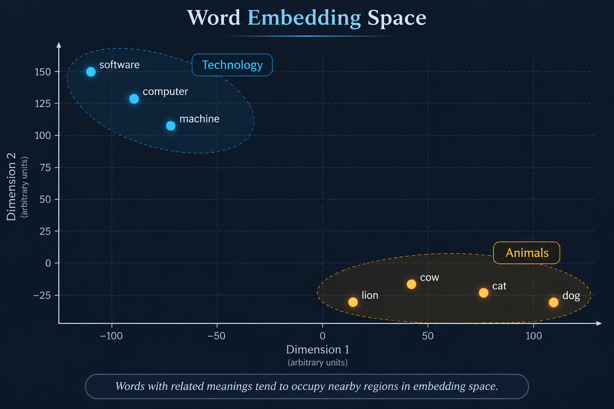

<div align="center">

# How Machines Represent Meaning

</div>

<div style="display: flex; justify-content: space-between;">

<a href="../episode-04/README.md">← Previous Episode</a>
&nbsp;&nbsp;&nbsp;&nbsp;&nbsp;&nbsp;&nbsp;&nbsp;&nbsp;&nbsp;&nbsp;&nbsp;&nbsp;&nbsp;&nbsp;&nbsp;&nbsp;&nbsp;&nbsp;&nbsp;&nbsp;&nbsp;&nbsp;&nbsp;&nbsp;&nbsp;&nbsp;&nbsp;&nbsp;&nbsp;&nbsp;&nbsp;&nbsp;&nbsp;&nbsp;&nbsp;&nbsp;&nbsp;&nbsp;&nbsp;&nbsp;&nbsp;&nbsp;&nbsp;&nbsp;&nbsp;&nbsp;&nbsp;&nbsp;&nbsp;&nbsp;&nbsp;&nbsp;&nbsp;&nbsp;&nbsp;&nbsp;&nbsp;&nbsp;&nbsp;&nbsp;&nbsp;&nbsp;&nbsp;&nbsp;&nbsp;&nbsp;&nbsp;&nbsp;&nbsp;&nbsp;&nbsp;&nbsp;&nbsp;&nbsp;&nbsp;&nbsp;&nbsp;&nbsp;&nbsp;&nbsp;&nbsp;&nbsp;&nbsp;&nbsp;&nbsp;&nbsp;&nbsp;&nbsp;&nbsp;&nbsp;&nbsp;&nbsp;&nbsp;&nbsp;&nbsp;&nbsp;&nbsp;&nbsp;&nbsp;&nbsp;&nbsp;&nbsp;&nbsp;&nbsp;&nbsp;&nbsp;&nbsp;&nbsp;&nbsp;&nbsp;&nbsp;&nbsp;&nbsp;&nbsp;&nbsp;&nbsp;&nbsp;&nbsp;&nbsp;&nbsp;&nbsp;&nbsp;&nbsp;&nbsp;&nbsp;&nbsp;&nbsp;&nbsp;&nbsp;&nbsp;&nbsp;&nbsp;&nbsp;&nbsp;&nbsp;&nbsp;&nbsp;&nbsp;&nbsp;&nbsp;&nbsp;&nbsp;&nbsp;&nbsp;&nbsp;&nbsp;&nbsp;&nbsp;&nbsp;&nbsp;&nbsp;&nbsp;&nbsp;&nbsp;&nbsp;&nbsp;&nbsp;&nbsp;&nbsp;&nbsp;&nbsp;&nbsp;&nbsp;&nbsp;&nbsp;&nbsp;&nbsp;&nbsp;&nbsp;&nbsp;&nbsp;
<a href="../episode-06/README.md">Next Episode →</a>

</div>

---

Machines represent meaning by converting **words, images, and concepts** into long lists of numbers called **vectors**.

Because computers only understand math and logic (ones and zeros), they can't feel or experience the real world the way humans do. Instead, they capture **meaning** using the **Distributional Hypothesis**.

> The `Distributional Hypothesis` is a foundational concept in linguistics and artificial intelligence, summarized by the famous quote by linguist John Rupert Firth:
>
> **"You shall know a word by the company it keeps."**
>
>## How It Works
>
>Machines do not have real-world experiences. They do not know what a **"banana"** tastes or looks like. Instead, they scan billions of sentences to see which words appear next to each other.
>
>### 1. The Setup
>
>Imagine a machine reads these sentences:
>
>- `"I ate a ripe banana."`
>- `"I ate a ripe apple."`
>
>### 2. The Pattern
>
>The machine notices that both **"banana"** and **"apple"** frequently appear next to words like:
>
>- `ate`
>- `ripe`
>- `sweet`
>- `fruit`
>
>### 3. The Conclusion
>
>Because **"banana"** and **"apple"** share a large amount of overlapping context, the machine concludes that they are **related concepts**.
>
>---
>
>## The Mathematical Map
>
>To use this hypothesis, AI systems build a giant **mathematical matrix (grid)**.
>
>### 1. Counting Context
>
>The machine tracks how often words appear near one another.
>
>### 2. Creating Coordinates
>
>These counts are turned into **coordinates (vectors)** on a multi-dimensional map.
>
>### 3. Measuring Closeness
>
>Concepts that are synonyms or belong to the same category naturally **cluster together** on this map because they share the same conversational >**"neighborhood."**
><p align="center">
>  <a href="./images/distributional-hypothesis.png">
>          src="./images/distributional-hypothesis.png" 
>      width="400"
>      alt="Architecture diagram"
>    />
>  </a>
>  <p align="center">
>    <em>Distributional Hypothesis</em>
>  </p>
></p>

Let's go one step deeper into the language of LLMs. Here is where things get really interesting.

**Imagine I say:**  `I went to the bank to deposit money.`

**Now I say:** `I sat near the bank and watched the river.`

The word `bank` is exactly the same in both sentences. But its meaning is completely different. In the first sentence, ***bank = financial institution*** and in second sentence, ***bank = side of a river***. 
<p align="center">
  <a href="./images/bank-story.png">
    
  </a>
  <p align="center">
    <em>Visual</em>
  </p>
</p>

**So here is the mystery:**

How does an AI model figure out that the same word means different things depending on the sentence?
This is one of the key problems NLP and modern language models are designed to solve. We already learned about tokenization and token IDs. Suppose the tokenizer gives us uniques IDs **Dog** represented with `8123`, **Grapes** with `8521` and **Elephant** with `17234`. The numerical distance between these IDs tells us nothing about their meaning. 
**Remember this: Token ID = identity, not meaning.** And this is an extremely important distinction.

__So Where Does Meaning Come From?__ 

Now comes the interesting part.The model doesn't try to understand the meaning of `8123`. Instead, that token ID is used to look up a learned numerical representation. 👇
<p align="center">
  <a href="./images/embedding.png">
    
  </a>
  <p align="center">
    <em>Embedding Visual</em>
  </p>
</p>

That final vector is where the interesting information begins to appear.But even that isn't the whole story. Because now we have another mystery.

### Let's return to our bank example.

```text
Sentence 1:
"I deposited money in the bank."

Sentence 2:
"I sat beside the river bank."
```
The tokenizer might produce a token for `bank` in both sentences. So we could have `bank--> same token ID`. Yet the meaning is different. How can the model distinguish them?
> The answer is:
>
>&nbsp;&nbsp;&nbsp;&nbsp;&nbsp;&nbsp;&nbsp;&nbsp;&nbsp;&nbsp;&nbsp;&nbsp;&nbsp;&nbsp;&nbsp;&nbsp;&nbsp;&nbsp;&nbsp;**Context**
>

The model doesn't look at the word bank in isolation. It looks at the words surrounding it.

```text
"I deposited money in the bank."

                    bank
                     ↑
           ┌─────────┼─────────┐
           │         │         │
       deposited    money      the
```
The surrounding words strongly suggest:
```text
bank + deposited + money
              ↓
       financial institution
```
Here, **"bank"** means a place where we deposit or manage money.

Now look at:
```text
"I sat beside the river bank."

                    bank
                     ↑
           ┌─────────┼─────────┐
           │         │         │
          river     beside      the
```

The surrounding words suggest:

```text
bank + river + beside
              ↓
         river bank
```
Here, **"bank"** means the **side of a river**.

The word **"bank"** itself has not changed.

What changes is the **context around the word**.

```text
Same Token
    │
    ▼
  "bank"
    │
    ├── deposited + money
    │         ↓
    │   Financial Institution
    │
    └── river + beside
              ↓
          River Bank
```

> **The token gives the model the identity of the word, but the surrounding context helps determine its meaning.**

So the model isn't asking **"What does the token ID `4217` mean?"** Instead, it is effectively learning **"What does this token mean given everything around it?"** That's a much more powerful question.

And this is where **Embeddings** become important. Remember our earlier discussion about vectors. A token can be represented using a vector:
```text
bank
 ↓
[0.21, -0.43, 0.71, 0.18, ...]
```
But when the model processes an entire sentence, it uses the surrounding context to build a richer representation.

**Conceptually:**

```text
"I deposited money in the bank."
              ↓
        [financial context]
              ↓
        bank representation
```

<p align="center">versus</p>

```text
"I sat beside the river bank."
              ↓
          [river context]
              ↓
        bank representation
```

So:
```text
bank + financial context
          !=
bank + river context
```

This is the foundation of contextual representations. And this leads us directly to one of the most important ideas in modern NLP:
>**A word does not have to carry its complete meaning by itself. Its surrounding context helps determine what it means.**

That's exactly why the journey from Token IDs → Embeddings → Contextual Embeddings is so important. And now we are ready to go one level deeper: how does the model actually combine all those surrounding tokens to construct that contextual meaning?

---

# **Vectorization**

It’s the process of converting information into numerical vectors. It’s like an array of numbers.
>*"Vectorization in large language models is the process of turning words, sentences, or images into long lists of numbers so that a computer can understand their meanings and relationships."*

Instead of trying what letters actually mean,vectorization turns every word, sentence, or document into a secret code of numbers (**called a vector**).

Think of it like plotting points on a giant map:
- Words with similar meanings live in the same neighborhood.
The numbers for `"Dog"` and `"Puppy"` will sit right next to each other on the map.
- Words with different meanings live far apart.
The numbers for `"Dog"` will sit very far away from `"Airplane"`.
- Relationships turn into simple directions.
If you take the numbers for `"King"`, subtract `"Man"`, and add `"Woman"`, the map points straight to `"Queen"`.
<p align="center">
  <a href="./images/3D-ploting.png">
    
  </a>
  <p align="center">
    <em>Visuals</em>
  </p>
</p>

>**💡 Why Does This Matter?**
>
>By converting human text into these numerical codes, computers don't actually need to "read" like we do. They just do math on the map!
>
>This simple translation process powers the everyday AI features we rely on:
>
>- **Translation apps** matching sentences across different languages.
>
>- **Search engines** understanding what you mean, not just exact words you typed.
>
>- **Spam filters** spotting suspicious emails based on their overall patterns.
>
>In short, vectorization is how we translate human language into a numerical map that machines can navigate instantly.

**simple Python code example that converts sentences into vectors.**

👉&nbsp;&nbsp;&nbsp;&nbsp;[Sentences-convert-to-vector](./Google-colab/sentence-convert-to-vector.ipynb)
[](./Google-colab/sentence-convert-to-vector.ipynb)

Vectors are essentially arrays of numbers that represent various features of the text. These arrays can be of different dimensions:

- **1D Vectors:** Represent individual words (e.g., word embeddings).

- **2D Vectors:** Represent sequences of words, such as sentences or documents (e.g., sentence embeddings).

- **Multi-Dimensional Vectors:** Can represent more complex structures and relationships, potentially involving higher-dimensional spaces.

When applying different vectorization techniques, the resulting vectors will vary depending on the method used. Each technique produces vectors with unique characteristics and ranges of values. For example, some techniques yield binary values (0 or 1), while others produce continuous values between 0 and 1. Below, we’ll see examples of vector outputs for BoW technique

<p align="center">
  <a href="./images/1D-2D-3D-vector.png">
    
  </a>
  <p align="center">
    <em>Visuals</em>
  </p>
</p>

## **Vectorization Techniques in NLP**

There are many technics, but we will talk about some common algorithms.

**1. One-Hot Encoding:** 
>One-Hot Encoding is a data preprocessing technique used to convert categorical data into a numerical format that machine learning models can understand.
>
>Imagine you're taking a quick survey at a restaurant, and it asks for your favorite meal: Pizza, Burger, or Tacos.
>If a computer were filling out this form, it would run into a problem. Computers don't understand words, they only understand numbers.
>
>A quick fix might be assigning each meal a number:
>- Pizza = 1
>- Burger = 2
>- Tacos = 3
>
>While that gives the computer numbers to work with, it accidentally creates a huge misunderstanding. The computer looks at those numbers and thinks: "Ah, **Tacos (3)** are three times better than **Pizza (1)**, and **Burgers (2)** are somewhere in the middle!" It assumes there is a ranking or hierarchy, even though you were just listing equal choices.
>
>To fix this, we use **One-Hot Encoding**.
>
>**🚨 How It Works: The Light Switch Method**
>
>Instead of using numbers to rank items, One-Hot Encoding turns each category into a simple On/Off switch (1 for "Yes", 0 for "No").
> 
>It creates a dedicated column for every choice:
>
>
>| Customer Choice | Is Pizza? | Is Burger? | Is Tacos? |
>|---|---:|---:|---:|
>| **Pizza** | 1 | 0 | 0 |
>| **Burger** | 0 | 1 | 0 |
>| **Tacos** | 0 | 0 | 1 |
>### Vector Representation
>
>```text
>Pizza  → [1, 0, 0]
>Burger → [0, 1, 0]
>Tacos  → [0, 0, 1]
>```
>Here:
>
>- `1` means **Yes / Present**
>- `0` means **No / Absent**
>
>Each food gets its own unique position in the vector.
>
>> **Important:** The numbers `1` and `0` only indicate >whether a particular category is present. They do **not** >represent similarity or meaning between the categories.
>
>**simple Python code example of One-Hot-Encoding**
>
>👉&nbsp;&nbsp;&nbsp;&nbsp;[One-Hot-Encoding](./Google-colab/One_Hot_Encoding.ipynb)
>[](./Google-colab/One_Hot_Encoding.ipynb)
>

**2. Bag of Words (BoW):** 

>In NLP, text data must be converted into numerical form so that machine learning algorithms can process it. The Bag of Words (BoW) model is a simple and commonly used method for **Converts text into a collection of words**, **Counts how often each word appears in the text**, **Ignores order of word and grammar , mainly focusing on frequency**.
>
>***In other way we can say that:***
> 
>The-bag-of-words model is a simple way to convert words to numerical representation by conceptualizing a document as a `“bag”` of words and noting the `frequency of each word`. Documents can then be embedded and fed into machine learning algorithms.
>
> **🚨 How Bag-of-Words Models Work**
>
>Imagine taking an entire article, cutting out every single word with a pair of scissors, and throwing them all into a giant **grocery bag**. Once inside the bag, the sentence order is completely lost. You don't know which word came first or how sentences were built. All you have is a big pile of loose words. If a computer wants to figure out what that document is about, it simply dumps out the bag and counts how many times each word appears.
>
>*🏷️ The Counting Checklist:*
>
>To turn this bag into numbers a machine can process, the computer creates a master checklist (**a vocabulary**) of every word it knows-say, 1,000 words total. For any document you hand it, the computer goes down its 1,000-word checklist and fills in the tally:
> - `"Coffee"`: 4
> - `"Morning"`: 2
> - `"Rocket"`: 0
> - `"Space"`: 0
>
>That final checklist of 1,000 counts becomes the document's numerical fingerprint (its vector).
>
>**💡 Why Use It?**
>
> - **It’s Super Simple:** It takes seconds to set up and requires very little computing power.
> - **Great for Basic Tasks:** If a document contains the words **"free"**, **"money"**, and **"click"**, a spam filter can easily flag it as spam just by counting those keywords.
>
> **simple Python code example of Bag-of-Words**
>
>👉&nbsp;&nbsp;&nbsp;&nbsp;[Bag-of-Words](./Google-colab/Bag_of_Words.ipynb)
>[](./Google-colab/Bag_of_Words.ipynb)
>
>### TF-IDF ( Term Frequency-Inverse Document Frequency)
>
>A key issue with bag-of-words is that simply tracking the frequency of words can lead to meaningless words — words like “a,” “some” and “the” — gaining too much influence over a model. That’s where Term Frequency-Inverse Document Frequency (TF-IDF) comes into play. This approach consists of two components: 
> - **Term Frequency:** Notes the frequency of a word in one document. 
>
> - **Inverse Document Frequency:** Notes the rareness of a word across all documents and downplays words that occur frequently across all documents. 
>
> [For more resources](https://builtin.com/articles/tf-idf) 


## Embeddings
Embeddings are numerical representations of real-world data—such as words, sentences, images, or audio—stored as a list of numbers called a vector.Embeddings are the way of representing data as numerical vectors in a continuous space. They capture the meaning or relationship between data points, so that similar items are placed closer together while dissimilar ones are farther apart. This makes it easier for algorithms to work with complex data such as words, images or audio.
- They convert categorical data into dense vectors.
- They are widely used in natural language processing, recommender systems and computer vision.
- These vectors help show what the objects mean and how they relate to each other.

**How Embeddings Work:**
- **Converting Data to Numbers:** Computers only understand math. Embeddings translate complex information into long lists of numbers (for example, [0.25, -0.41, 0.88])
- **Measuring Distance:**  The distance between vectors shows how related they are. Close points mean high similarity (like "king" and "queen"), while far points mean unrelated topics (like "king" and "apple").
- **Capturing Meaning (Semantics):**  Items with similar meanings or traits are placed close together in a mathematical space.

<p align="center">
  <a href="./images/embeddingDetails.png">
    
  </a>
  <p align="center">
    <em>Embeddings</em>
  </p>
</p>

👉&nbsp;&nbsp;&nbsp;&nbsp;[Play with Embedding Projector](https://projector.tensorflow.org/)
[](https://projector.tensorflow.org/)

**what is semantic similarity**

Semantic similarity in embeddings is the measure of how close two pieces of text are in meaning, based on their numerical representations in a shared vector space.

**How semantic similarity works**

- **Text to Numbers:** An AI model (like a transformer) turns words, sentences, or documents into an embedding—a long list of numbers (a vector).
- **Clustering in Space:** These numbers act as coordinates in a high-dimensional space. Words or sentences with similar meanings land physically close to each other. For example, "king" and "queen" sit near each other, and "how to get a business loan" sits near "steps to secure company funding", even though the words are different.
- **Measuring Distance:**  The system calculates the closeness of these vectors.

**Common Ways to Measure Similarity**

- **Cosine Similarity:** Measures the angle between two vectors. It outputs a score from 0 (completely unrelated) to 1 (identical meaning).
- **Euclidean Distance:** Measures the straight-line distance between two points in the vector space. A smaller distance means a higher similarity.


# 📐 Cosine Similarity

> **How similar are two vectors?**
>
> Instead of asking *"How far apart are these vectors?"*, cosine similarity asks:
>
> **"How similar is their direction?"**

Cosine Similarity is one of the most important concepts in:

- 🤖 Machine Learning
- 🧠 Natural Language Processing
- 🔎 Semantic Search
- 📚 Information Retrieval
- 🎯 Recommendation Systems
- 🧬 Embeddings
- 🗄️ Vector Databases

Mathematically, cosine similarity is the **normalized dot product** of two vectors.

---

# 🧭 1. Intuition First

Imagine two vectors starting from the same point:

```text
                    B
                   ↗
                  /
                 /
                / θ
               /
              /
O────────────→ A
```

The angle between them is:

$$
\theta
$$

Cosine similarity measures:

$$
\boxed{\cos(\theta)}
$$

So the fundamental idea is:

> **Smaller angle → more similar direction**

---

# 📊 2. Understanding the Score

For non-zero vectors:

| Cosine Similarity | Meaning |
|---:|---|
| `+1` | Same direction |
| `+0.8` | Very similar direction |
| `+0.5` | Moderately similar |
| `0` | Perpendicular |
| `-0.5` | Opposite tendency |
| `-1` | Exactly opposite direction |

Mathematically:

$$
-1\leq \cos(\theta)\leq1
$$

⚠️ In many NLP applications, vectors such as TF-IDF representations are non-negative, so scores commonly fall between `0` and `1`. But general real-valued vectors can produce negative cosine similarity.

---

# 🧮 3. The Main Formula

Suppose we have two vectors:

$$
\mathbf{A}=(A_1,A_2,\dots,A_n)
$$

and

$$
\mathbf{B}=(B_1,B_2,\dots,B_n)
$$

Then:

```math
\text{Cosine Similarity}
=
\frac{\mathbf{A}\cdot\mathbf{B}}
{\|\mathbf{A}\|\,\|\mathbf{B}\|}
```

This formula has **three important parts**:

```text
              A · B
Cosine = ───────────────
             ||A|| ||B||

           ↓       ↓
       Dot Product  Magnitudes
```

---

# 🔢 4. Breaking Down the Formula

## 4.1 Dot Product

For:

$$
A=(A_1,A_2,\dots,A_n)
$$

$$
B=(B_1,B_2,\dots,B_n)
$$

the dot product is:

```math
A \cdot B
=
\sum_{i=1}^{n} A_i B_i
```

For example:

$$
A=(1,2,3)
$$

$$
B=(4,5,6)
$$

Then:

```math
A \cdot B
=
(1)(4)+(2)(5)+(3)(6)
```

```math
=4+10+18
```

```math
\boxed{32}
```

---

# 📏 5. Vector Magnitude

The magnitude or length of a vector is:

```math
\boxed{
\|A\|
=
\sqrt{\sum_{i=1}^{n} A_i^2}
}
```

For:

$$
A=(1,2,3)
$$

we get:

```math
\begin{aligned}
\|A\|
&= \sqrt{1^2 + 2^2 + 3^2} \\
&= \sqrt{1 + 4 + 9} \\
&= \sqrt{14}
\end{aligned}
```

$$
=\sqrt{14}
$$

---

# 🎯 6. Complete Mathematical Example

Let's calculate cosine similarity between:

$$
A=(1,2,3)
$$

and:

$$
B=(4,5,6)
$$

---

## Step 1️⃣ — Calculate Dot Product

```math
\begin{aligned}
A \cdot B
&= (1)(4) + (2)(5) + (3)(6) \\
&= 4 + 10 + 18
\end{aligned}
```

$$
\boxed{A\cdot B=32}
$$

---

## Step 2️⃣ — Calculate Magnitude of A

```math
\begin{aligned}
\|A\|
&= \sqrt{1^2 + 2^2 + 3^2} \\
&= \sqrt{14}
\end{aligned}
```

---

## Step 3️⃣ — Calculate Magnitude of B

```math
\begin{aligned}
\|B\|
&= \sqrt{4^2 + 5^2 + 6^2} \\
&= \sqrt{16 + 25 + 36} \\
&= \sqrt{77}
\end{aligned}
```

---

## Step 4️⃣ — Substitute into Formula

```math
\begin{aligned}
\text{Cosine Similarity}
&= \frac{32}{\sqrt{14}\sqrt{77}} \\
&= \frac{32}{\sqrt{14 \times 77}} \\
&= \frac{32}{\sqrt{1078}} \\
&\approx \boxed{0.9746}
\end{aligned}
```

---

# 🧠 7. What Does 0.9746 Mean?

We obtained:

$$
0.9746
$$

This is very close to:

$$
1
$$

Therefore, vectors `A` and `B` point in **very similar directions**.

```text
Similarity

-1          0          +1
│-----------│-----------│
Opposite    ⟂        Same Direction
                         ↑
                       0.9746
```

---

# 🔥 8. Why Normalize?

Consider:

$$
A=(1,2)
$$

and:

$$
B=(2,4)
$$

Notice:

$$
B=2A
$$

So:

```text
A = ───────→

B = ────────────────→
```

Their magnitudes are different.

But their **directions are identical**.

Therefore:

$$
\boxed{
\text{Cosine Similarity}=1
}
$$

This is the major intuition behind cosine similarity:

> **Magnitude can change while direction remains the same.**

---

# 💯 9. Perfect Similarity

Consider:

$$
A=(1,2,3)
$$

$$
B=(2,4,6)
$$

Since:

$$
B=2A
$$

the vectors point in exactly the same direction.

Therefore:

$$
\boxed{\cos(\theta)=1}
$$

Let's verify mathematically.

### Dot Product

```math
\begin{aligned}
A \cdot B
&= (1)(2) + (2)(4) + (3)(6) \\
&= 2 + 8 + 18 \\
&= 28
\end{aligned}
```

### Magnitudes

```math
\begin{aligned}
\|A\|
&= \sqrt{14} \\[4pt]
\|B\|
&= \sqrt{2^2 + 4^2 + 6^2} \\
&= \sqrt{56} \\
&= 2\sqrt{14} \\[6pt]
\text{Cosine Similarity}
&= \frac{28}{\sqrt{14}(2\sqrt{14})} \\
&= \frac{28}{28} \\
&= \boxed{1}
\end{aligned}
```

---

# 🚫 10. Perpendicular Vectors

Consider:

$$
A=(1,0)
$$

and:

$$
B=(0,1)
$$

Calculate the dot product:

$$
A\cdot B
=
(1)(0)+(0)(1)
$$

$$
=0
$$

Therefore:

$$
\text{Cosine Similarity}
=
\frac{0}{\|A\|\|B\|}
$$

$$
\boxed{0}
$$

The angle between them is:

$$
\theta=90^\circ
$$

and:

$$
\cos(90^\circ)=0
$$

---

# 🔄 11. Opposite Vectors

Consider:

$$
A=(1,2)
$$

and:

$$
B=(-1,-2)
$$

Notice:

$$
B=-A
$$

Calculate:

$$
A\cdot B
=
(1)(-1)+(2)(-2)
$$

$$
=-1-4
$$

$$
=-5
$$

Magnitudes:

$$
\|A\|=\sqrt5
$$

$$
\|B\|=\sqrt5
$$

Therefore:

$$
\text{Cosine Similarity}
=
\frac{-5}{\sqrt5\sqrt5}
$$

$$
=
\frac{-5}{5}
$$

$$
\boxed{-1}
$$

So:

> **Opposite direction → cosine similarity = -1**

---

# 🧩 12. The Three Cases You MUST Remember

```text
                 COSINE SIMILARITY
                        │
          ┌─────────────┼─────────────┐
          ↓             ↓             ↓
        +1              0            -1
          │             │             │
          ↓             ↓             ↓
    Same Direction   90° Angle   Opposite Direction
```

Mathematically:

$$
\boxed{
\begin{aligned}
\theta=0^\circ   &\Rightarrow \cos\theta=1\\
\theta=90^\circ  &\Rightarrow \cos\theta=0\\
\theta=180^\circ &\Rightarrow \cos\theta=-1
\end{aligned}
}
$$

---

# 🧠 13. Cosine Similarity in NLP

This is where cosine similarity becomes extremely useful.

Suppose we have:

```text
Sentence 1:
"I love machine learning."

Sentence 2:
"I enjoy artificial intelligence."
```

A model can convert each sentence into an embedding:

```text
Sentence 1
     ↓
[0.21, 0.82, -0.13, 0.45, ...]
     
Sentence 2
     ↓
[0.19, 0.79, -0.11, 0.48, ...]
```

Now we calculate:

$$
\text{Cosine Similarity}(E_1,E_2)
$$

If the vectors point in similar directions, the similarity score will be high.

This basic operation is widely used for comparing vector representations, including document vectors.

---

# 🔎 14. Semantic Search

Imagine searching:

```text
"How can I reset my password?"
```

The database may contain:

```text
Document 1:
"How do I change my password?"

Document 2:
"How do I make pasta?"

Document 3:
"Best places to travel in India"
```

Convert everything into vectors:

```text
Query
  ↓
Embedding
  ↓
Compare with document embeddings
  ↓
Cosine Similarity
  ↓
Rank results
```

Example:

| Document | Cosine Similarity |
|---|---:|
| Password reset | `0.94` |
| Pasta recipe | `0.21` |
| Travel guide | `0.08` |

The system can rank the password document first.

---

# 📚 15. Cosine Similarity and TF-IDF

Cosine similarity is commonly used with document representations such as **TF-IDF vectors**.

Suppose:

```text
Vocabulary:

[Python, Java, Database, Machine Learning]
```

Document A:

$$
A=(3,1,0,2)
$$

Document B:

$$
B=(2,1,0,3)
$$

Cosine similarity lets us compare their **direction in feature space**.

This is one of the foundations of the classical **Vector Space Model** used in information retrieval.

---

# ⚔️ 16. Cosine Similarity vs Euclidean Distance

Consider:

$$
A=(1,2)
$$

$$
B=(10,20)
$$

The vectors have very different magnitudes.

But:

$$
B=10A
$$

Therefore:

$$
\boxed{\text{Cosine Similarity}=1}
$$

because their directions are identical.

However, Euclidean distance is:

$$
d(A,B)
=
\sqrt{(10-1)^2+(20-2)^2}
$$

$$
=
\sqrt{81+324}
$$

$$
=\sqrt{405}
$$

which is large.

### Key difference:

| Metric | Focus |
|---|---|
| **Cosine Similarity** | Direction / angle |
| **Euclidean Distance** | Physical distance |
| **Dot Product** | Alignment + magnitude |

---


# 🟠 17.  Think Before Calculating

Given:

$$
A=(3,6,9)
$$

$$
B=(1,2,3)
$$

Can you determine cosine similarity **without doing the full calculation?**

### Solution

Observe:

$$
A=3B
$$

Therefore, both vectors point in exactly the same direction.

Hence:

$$
\boxed{\text{Cosine Similarity}=1}
$$

### 💡 Lesson

Before calculating, **look for proportional vectors**.

It can save you a lot of mathematical work.

---


### Q1. What is cosine similarity?

Cosine similarity measures the cosine of the angle between two non-zero vectors:

$$
\boxed{
\frac{A\cdot B}{\|A\|\|B\|}
}
$$

---

### Q2. Why is it called "cosine" similarity?

Because the normalized dot product is equal to:

$$
\cos(\theta)
$$

where $\theta$ is the angle between the vectors.

---

### Q3. What does cosine similarity = 1 mean?

The vectors point in exactly the same direction.

---

### Q4. What does cosine similarity = 0 mean?

The vectors are perpendicular.

---

### Q5. What does cosine similarity = -1 mean?

The vectors point in exactly opposite directions.

---

### Q6. Why is cosine similarity popular in NLP?

Because text documents and embeddings can be represented as vectors, and cosine similarity provides a way to compare their directional alignment. It is commonly used with TF-IDF document vectors and other vector representations.

---

### Q7. What happens with a zero vector?

Cosine similarity is undefined because:

$$
\|A\|=0
$$

would make the denominator zero.

---

# 💻 23. Python Implementation

```python
import math


def cosine_similarity(A, B):

    # Step 1: Dot Product
    dot_product = sum(a * b for a, b in zip(A, B))

    # Step 2: Magnitude of A
    magnitude_A = math.sqrt(
        sum(a * a for a in A)
    )

    # Step 3: Magnitude of B
    magnitude_B = math.sqrt(
        sum(b * b for b in B)
    )

    # Zero-vector check
    if magnitude_A == 0 or magnitude_B == 0:
        raise ValueError(
            "Cosine similarity is undefined for zero vectors."
        )

    # Step 4: Cosine Similarity
    return dot_product / (
        magnitude_A * magnitude_B
    )


A = [1, 2, 3]
B = [4, 5, 6]

result = cosine_similarity(A, B)

print(result)
```

Output:

```text
0.974631846
```

---

# 🧠 24. The 4-Step Mental Model

Whenever you get a cosine similarity question in an interview:

```text
        TWO VECTORS
             │
             ↓
      ┌──────────────┐
      │ Dot Product  │
      └──────┬───────┘
             ↓
      ┌──────────────┐
      │ Magnitude A  │
      └──────┬───────┘
             ↓
      ┌──────────────┐
      │ Magnitude B  │
      └──────┬───────┘
             ↓
      ┌──────────────┐
      │ Divide Them  │
      └──────┬───────┘
             ↓
      COSINE SCORE
```

Remember:

$$
\boxed{
\text{Cosine Similarity}
=
\frac{\text{Dot Product}}
{\text{Magnitude A}\times\text{Magnitude B}}
}
$$


---

# 🎯 Final Takeaway

The entire concept can be compressed into one sentence:

> **Cosine similarity measures how closely two vectors point in the same direction.**

And the equation you should remember is:

$$
\boxed{
\text{Cosine Similarity}
=
\frac{\mathbf{A}\cdot\mathbf{B}}
{\|\mathbf{A}\|\|\mathbf{B}\|}
}
$$

The three most important cases:

$$
\boxed{
\begin{aligned}
1   &\rightarrow \text{Same direction}\\
0   &\rightarrow \text{Perpendicular}\\
-1  &\rightarrow \text{Opposite direction}
\end{aligned}
}
$$

From **vectors → embeddings → semantic similarity → search**, cosine similarity is one of the fundamental mathematical building blocks behind modern ML/NLP systems.

---


## 💻 Python

```python
import math


def cosine_similarity(A, B):

    dot_product = sum(a * b for a, b in zip(A, B))

    magnitude_A = math.sqrt(
        sum(a * a for a in A)
    )

    magnitude_B = math.sqrt(
        sum(b * b for b in B)
    )

    if magnitude_A == 0 or magnitude_B == 0:
        raise ValueError(
            "Cosine similarity is undefined for zero vectors."
        )

    return dot_product / (
        magnitude_A * magnitude_B
    )


A = [1, 2, 3]
B = [4, 5, 6]

print(cosine_similarity(A, B))
```

Output:

```text
0.974631846
```

---

### ⭐ Remember

```math
\boxed{
\text{Cosine Similarity}
=
\frac{\mathbf{A}\cdot\mathbf{B}}
{\|\mathbf{A}\|\,\|\mathbf{B}\|}
}
```

> 💡 **Don't just memorize the formula — understand the geometry behind it.**