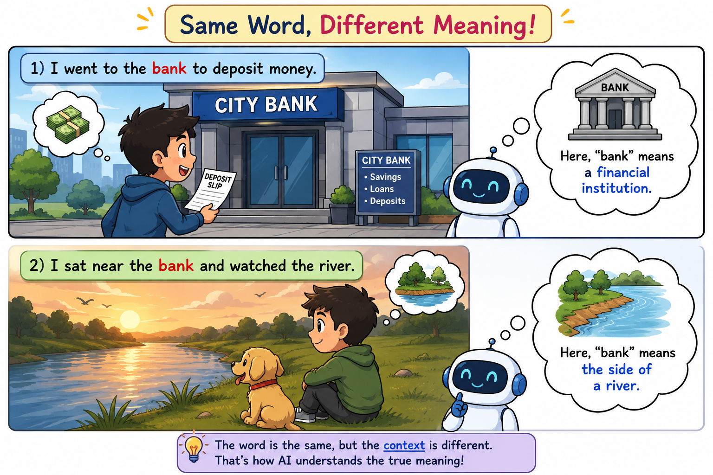
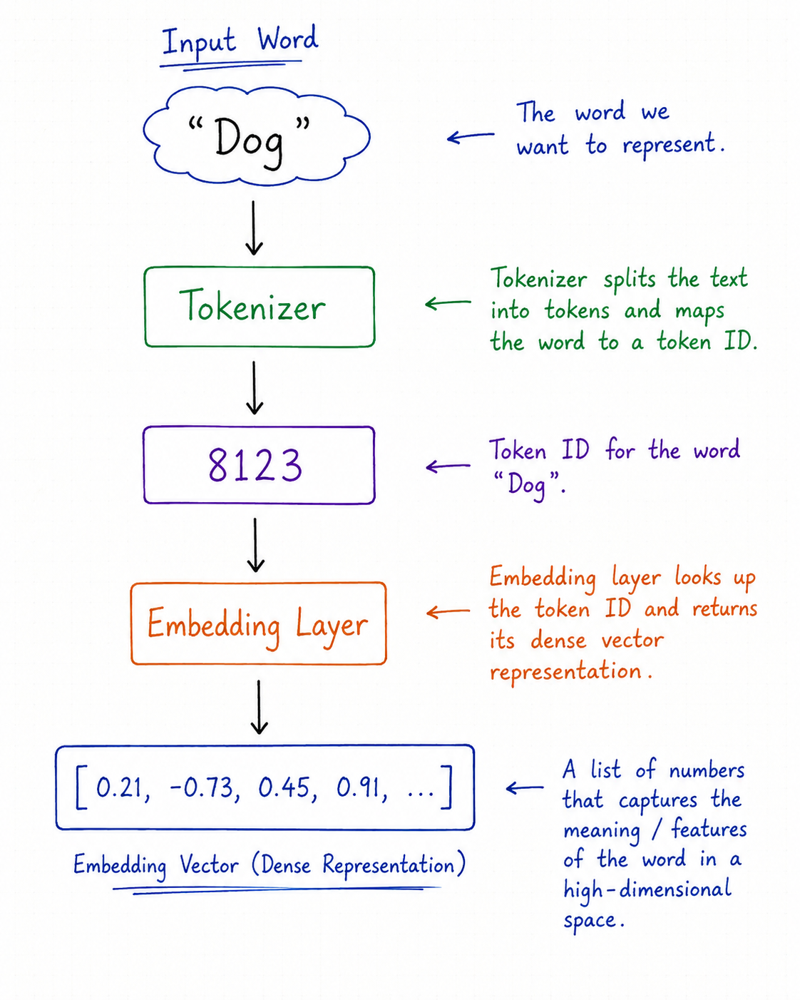
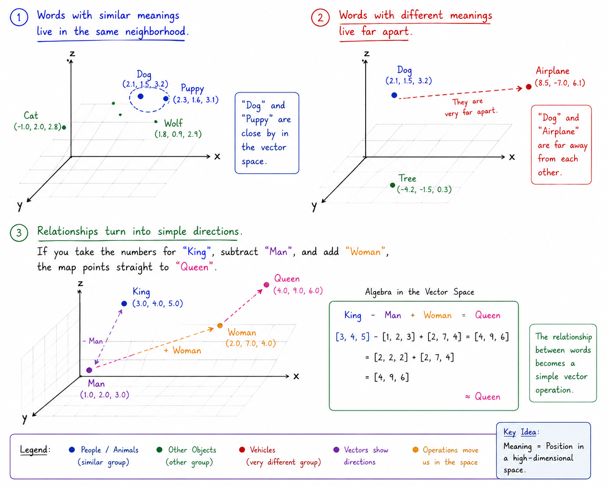
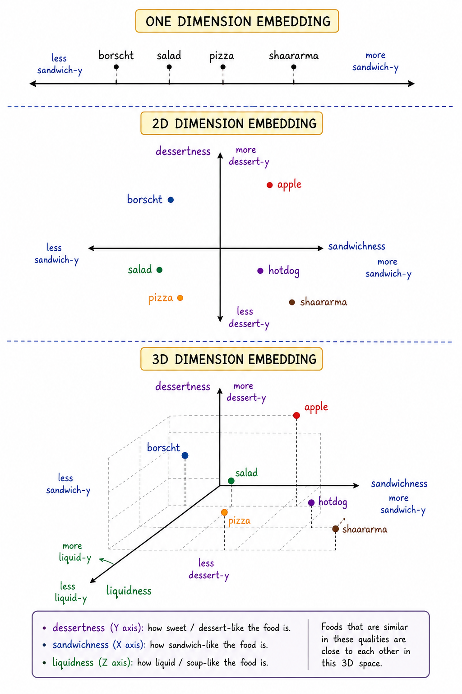

<div align="center">

# How Machines Represent Meaning

</div>

<div style="display: flex; justify-content: space-between;">

<a href="../episode-04/README.md">← Previous Episode</a>
&nbsp;&nbsp;&nbsp;&nbsp;&nbsp;&nbsp;&nbsp;&nbsp;&nbsp;&nbsp;&nbsp;&nbsp;&nbsp;&nbsp;&nbsp;&nbsp;&nbsp;&nbsp;&nbsp;&nbsp;&nbsp;&nbsp;&nbsp;&nbsp;&nbsp;&nbsp;&nbsp;&nbsp;&nbsp;&nbsp;&nbsp;&nbsp;&nbsp;&nbsp;&nbsp;&nbsp;&nbsp;&nbsp;&nbsp;&nbsp;&nbsp;&nbsp;&nbsp;&nbsp;&nbsp;&nbsp;&nbsp;&nbsp;&nbsp;&nbsp;&nbsp;&nbsp;&nbsp;&nbsp;&nbsp;&nbsp;&nbsp;&nbsp;&nbsp;&nbsp;&nbsp;&nbsp;&nbsp;&nbsp;&nbsp;&nbsp;&nbsp;&nbsp;&nbsp;&nbsp;&nbsp;&nbsp;&nbsp;&nbsp;&nbsp;&nbsp;&nbsp;&nbsp;&nbsp;&nbsp;&nbsp;&nbsp;&nbsp;&nbsp;&nbsp;&nbsp;&nbsp;&nbsp;&nbsp;&nbsp;&nbsp;&nbsp;&nbsp;&nbsp;&nbsp;&nbsp;&nbsp;&nbsp;&nbsp;&nbsp;&nbsp;&nbsp;&nbsp;&nbsp;&nbsp;&nbsp;&nbsp;&nbsp;&nbsp;&nbsp;&nbsp;&nbsp;&nbsp;&nbsp;&nbsp;&nbsp;&nbsp;&nbsp;&nbsp;&nbsp;&nbsp;&nbsp;&nbsp;&nbsp;&nbsp;&nbsp;&nbsp;&nbsp;&nbsp;&nbsp;&nbsp;&nbsp;&nbsp;&nbsp;&nbsp;&nbsp;&nbsp;&nbsp;&nbsp;&nbsp;&nbsp;&nbsp;&nbsp;&nbsp;&nbsp;&nbsp;&nbsp;&nbsp;&nbsp;&nbsp;&nbsp;&nbsp;&nbsp;&nbsp;&nbsp;&nbsp;&nbsp;&nbsp;&nbsp;&nbsp;&nbsp;&nbsp;&nbsp;&nbsp;&nbsp;&nbsp;&nbsp;&nbsp;&nbsp;&nbsp;&nbsp;&nbsp;
<a href="../episode-06/README.md">Next Episode →</a>

</div>

---

Machines represent meaning by converting **words, images, and concepts** into long lists of numbers called **vectors**.

Because computers only understand math and logic (ones and zeros), they can't feel or experience the real world the way humans do. Instead, they capture **meaning** using the **Distributional Hypothesis**.

> The `Distributional Hypothesis` is a foundational concept in linguistics and artificial intelligence, summarized by the famous quote by linguist John Rupert Firth:
>
> **"You shall know a word by the company it keeps."**
>
>## How It Works
>
>Machines do not have real-world experiences. They do not know what a **"banana"** tastes or looks like. Instead, they scan billions of sentences to see which words appear next to each other.
>
>### 1. The Setup
>
>Imagine a machine reads these sentences:
>
>- `"I ate a ripe banana."`
>- `"I ate a ripe apple."`
>
>### 2. The Pattern
>
>The machine notices that both **"banana"** and **"apple"** frequently appear next to words like:
>
>- `ate`
>- `ripe`
>- `sweet`
>- `fruit`
>
>### 3. The Conclusion
>
>Because **"banana"** and **"apple"** share a large amount of overlapping context, the machine concludes that they are **related concepts**.
>
>---
>
>## The Mathematical Map
>
>To use this hypothesis, AI systems build a giant **mathematical matrix (grid)**.
>
>### 1. Counting Context
>
>The machine tracks how often words appear near one another.
>
>### 2. Creating Coordinates
>
>These counts are turned into **coordinates (vectors)** on a multi-dimensional map.
>
>### 3. Measuring Closeness
>
>Concepts that are synonyms or belong to the same category naturally **cluster together** on this map because they share the same conversational >**"neighborhood."**
><p align="center">
>  <a href="./images/distributional-hypothesis.png">
>          src="./images/distributional-hypothesis.png" 
>      width="400"
>      alt="Architecture diagram"
>    />
>  </a>
>  <p align="center">
>    <em>Distributional Hypothesis</em>
>  </p>
></p>

Let's go one step deeper into the language of LLMs. Here is where things get really interesting.

**Imagine I say:**  `I went to the bank to deposit money.`

**Now I say:** `I sat near the bank and watched the river.`

The word `bank` is exactly the same in both sentences. But its meaning is completely different. In the first sentence, ***bank = financial institution*** and in second sentence, ***bank = side of a river***. 
<p align="center">
  <a href="./images/bank-story.png">
    
  </a>
  <p align="center">
    <em>Visual</em>
  </p>
</p>

**So here is the mystery:**

How does an AI model figure out that the same word means different things depending on the sentence?
This is one of the key problems NLP and modern language models are designed to solve. We already learned about tokenization and token IDs. Suppose the tokenizer gives us uniques IDs **Dog** represented with `8123`, **Grapes** with `8521` and **Elephant** with `17234`. The numerical distance between these IDs tells us nothing about their meaning. 
**Remember this: Token ID = identity, not meaning.** And this is an extremely important distinction.

__So Where Does Meaning Come From?__ 

Now comes the interesting part.The model doesn't try to understand the meaning of `8123`. Instead, that token ID is used to look up a learned numerical representation. 👇
<p align="center">
  <a href="./images/embedding.png">
    
  </a>
  <p align="center">
    <em>Embedding Visual</em>
  </p>
</p>

That final vector is where the interesting information begins to appear.But even that isn't the whole story. Because now we have another mystery.

### Let's return to our bank example.

```text
Sentence 1:
"I deposited money in the bank."

Sentence 2:
"I sat beside the river bank."
```
The tokenizer might produce a token for `bank` in both sentences. So we could have `bank--> same token ID`. Yet the meaning is different. How can the model distinguish them?
> The answer is:
>
>&nbsp;&nbsp;&nbsp;&nbsp;&nbsp;&nbsp;&nbsp;&nbsp;&nbsp;&nbsp;&nbsp;&nbsp;&nbsp;&nbsp;&nbsp;&nbsp;&nbsp;&nbsp;&nbsp;**Context**
>

The model doesn't look at the word bank in isolation. It looks at the words surrounding it.

```text
"I deposited money in the bank."

                    bank
                     ↑
           ┌─────────┼─────────┐
           │         │         │
       deposited    money      the
```
The surrounding words strongly suggest:
```text
bank + deposited + money
              ↓
       financial institution
```
Here, **"bank"** means a place where we deposit or manage money.

Now look at:
```text
"I sat beside the river bank."

                    bank
                     ↑
           ┌─────────┼─────────┐
           │         │         │
          river     beside      the
```

The surrounding words suggest:

```text
bank + river + beside
              ↓
         river bank
```
Here, **"bank"** means the **side of a river**.

The word **"bank"** itself has not changed.

What changes is the **context around the word**.

```text
Same Token
    │
    ▼
  "bank"
    │
    ├── deposited + money
    │         ↓
    │   Financial Institution
    │
    └── river + beside
              ↓
          River Bank
```

> **The token gives the model the identity of the word, but the surrounding context helps determine its meaning.**

So the model isn't asking **"What does the token ID `4217` mean?"** Instead, it is effectively learning **"What does this token mean given everything around it?"** That's a much more powerful question.

And this is where **Embeddings** become important. Remember our earlier discussion about vectors. A token can be represented using a vector:
```text
bank
 ↓
[0.21, -0.43, 0.71, 0.18, ...]
```
But when the model processes an entire sentence, it uses the surrounding context to build a richer representation.

**Conceptually:**

```text
"I deposited money in the bank."
              ↓
        [financial context]
              ↓
        bank representation
```

<p align="center">versus</p>

```text
"I sat beside the river bank."
              ↓
          [river context]
              ↓
        bank representation
```

So:
```text
bank + financial context
          !=
bank + river context
```

This is the foundation of contextual representations. And this leads us directly to one of the most important ideas in modern NLP:
>**A word does not have to carry its complete meaning by itself. Its surrounding context helps determine what it means.**

That's exactly why the journey from Token IDs → Embeddings → Contextual Embeddings is so important. And now we are ready to go one level deeper: how does the model actually combine all those surrounding tokens to construct that contextual meaning?

---

# **Vectorization**

It’s the process of converting information into numerical vectors. It’s like an array of numbers.
>*"Vectorization in large language models is the process of turning words, sentences, or images into long lists of numbers so that a computer can understand their meanings and relationships."*

Instead of trying what letters actually mean,vectorization turns every word, sentence, or document into a secret code of numbers (**called a vector**).

Think of it like plotting points on a giant map:
- Words with similar meanings live in the same neighborhood.
The numbers for `"Dog"` and `"Puppy"` will sit right next to each other on the map.
- Words with different meanings live far apart.
The numbers for `"Dog"` will sit very far away from `"Airplane"`.
- Relationships turn into simple directions.
If you take the numbers for `"King"`, subtract `"Man"`, and add `"Woman"`, the map points straight to `"Queen"`.
<p align="center">
  <a href="./images/3D-ploting.png">
    
  </a>
  <p align="center">
    <em>Visuals</em>
  </p>
</p>

>**💡 Why Does This Matter?**
>
>By converting human text into these numerical codes, computers don't actually need to "read" like we do. They just do math on the map!
>
>This simple translation process powers the everyday AI features we rely on:
>
>- **Translation apps** matching sentences across different languages.
>
>- **Search engines** understanding what you mean, not just exact words you typed.
>
>- **Spam filters** spotting suspicious emails based on their overall patterns.
>
>In short, vectorization is how we translate human language into a numerical map that machines can navigate instantly.

**simple Python code example that converts sentences into vectors.**

👉&nbsp;&nbsp;&nbsp;&nbsp;[Sentences-convert-to-vector](./Google-colab/sentence-convert-to-vector.ipynb)
[](./Google-colab/sentence-convert-to-vector.ipynb)

Vectors are essentially arrays of numbers that represent various features of the text. These arrays can be of different dimensions:

- **1D Vectors:** Represent individual words (e.g., word embeddings).

- **2D Vectors:** Represent sequences of words, such as sentences or documents (e.g., sentence embeddings).

- **Multi-Dimensional Vectors:** Can represent more complex structures and relationships, potentially involving higher-dimensional spaces.

When applying different vectorization techniques, the resulting vectors will vary depending on the method used. Each technique produces vectors with unique characteristics and ranges of values. For example, some techniques yield binary values (0 or 1), while others produce continuous values between 0 and 1. Below, we’ll see examples of vector outputs for BoW technique

<p align="center">
  <a href="./images/1D-2D-3D-vector.png">
    
  </a>
  <p align="center">
    <em>Visuals</em>
  </p>
</p>

## **Vectorization Techniques in NLP**

There are many technics, but we will talk about some common algorithms.

**1. One-Hot Encoding:** 
>One-Hot Encoding is a data preprocessing technique used to convert categorical data into a numerical format that machine learning models can understand.
>
>Imagine you're taking a quick survey at a restaurant, and it asks for your favorite meal: Pizza, Burger, or Tacos.
>If a computer were filling out this form, it would run into a problem. Computers don't understand words, they only understand numbers.
>
>A quick fix might be assigning each meal a number:
>- Pizza = 1
>- Burger = 2
>- Tacos = 3
>
>While that gives the computer numbers to work with, it accidentally creates a huge misunderstanding. The computer looks at those numbers and thinks: "Ah, **Tacos (3)** are three times better than **Pizza (1)**, and **Burgers (2)** are somewhere in the middle!" It assumes there is a ranking or hierarchy, even though you were just listing equal choices.
>
>To fix this, we use **One-Hot Encoding**.
>
>**🚨 How It Works: The Light Switch Method**
>
>Instead of using numbers to rank items, One-Hot Encoding turns each category into a simple On/Off switch (1 for "Yes", 0 for "No").
> 
>It creates a dedicated column for every choice:
>
>
>| Customer Choice | Is Pizza? | Is Burger? | Is Tacos? |
>|---|---:|---:|---:|
>| **Pizza** | 1 | 0 | 0 |
>| **Burger** | 0 | 1 | 0 |
>| **Tacos** | 0 | 0 | 1 |
>### Vector Representation
>
>```text
>Pizza  → [1, 0, 0]
>Burger → [0, 1, 0]
>Tacos  → [0, 0, 1]
>```
>Here:
>
>- `1` means **Yes / Present**
>- `0` means **No / Absent**
>
>Each food gets its own unique position in the vector.
>
>> **Important:** The numbers `1` and `0` only indicate >whether a particular category is present. They do **not** >represent similarity or meaning between the categories.
>
>**simple Python code example of One-Hot-Encoding**
>
>👉&nbsp;&nbsp;&nbsp;&nbsp;[One-Hot-Encoding](./Google-colab/One_Hot_Encoding.ipynb)
>[](./Google-colab/One_Hot_Encoding.ipynb)
>

**2. Bag of Words (BoW):** 

>In NLP, text data must be converted into numerical form so >that machine learning algorithms can process it. The Bag of Words (BoW) model is a simple and commonly used method for **Converts text into a collection of words**, **Counts how often each word appears in the text**, **Ignores order of word and grammar , mainly focusing on frequency**.
>
>***In other way we can say that:***
> 
>The-bag-of-words model is a simple way to convert words to numerical representation by conceptualizing a document as a `“bag”` of words and noting the `frequency of each word`. Documents can then be embedded and fed into machine learning algorithms.
>
> **🚨 How Bag-of-Words Models Work**
>
>Imagine taking an entire article, cutting out every single word with a pair of scissors, and throwing them all into a giant **grocery bag**. Once inside the bag, the sentence order is completely lost. You don't know which word came first or how sentences were built. All you have is a big pile of loose words. If a computer wants to figure out what that document is about, it simply dumps out the bag and counts how many times each word appears.
>
>*🏷️ The Counting Checklist:*
>
>To turn this bag into numbers a machine can process, the computer creates a master checklist (**a vocabulary**) of every word it knows-say, 1,000 words total. For any document you hand it, the computer goes down its 1,000-word checklist and fills in the tally:
> - `"Coffee"`: 4
> - `"Morning"`: 2
> - `"Rocket"`: 0
> - `"Space"`: 0
>
>That final checklist of 1,000 counts becomes the document's numerical fingerprint (its vector).
>
>**💡 Why Use It?**
>
> - **It’s Super Simple:** It takes seconds to set up and requires very little computing power.
> - **Great for Basic Tasks:** If a document contains the words **"free"**, **"money"**, and **"click"**, a spam filter can easily flag it as spam just by counting those keywords.
>
> **simple Python code example of Bag-of-Words**
>
>👉&nbsp;&nbsp;&nbsp;&nbsp;[Bag-of-Words](./Google-colab/Bag_of_Words.ipynb)
>[](./Google-colab/Bag_of_Words.ipynb)