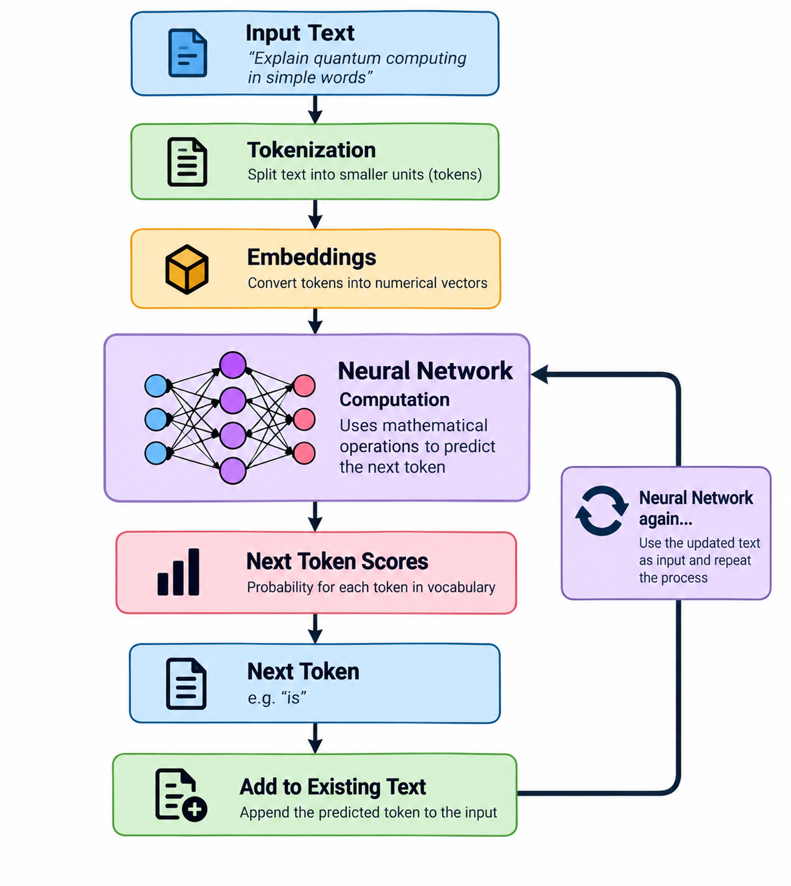
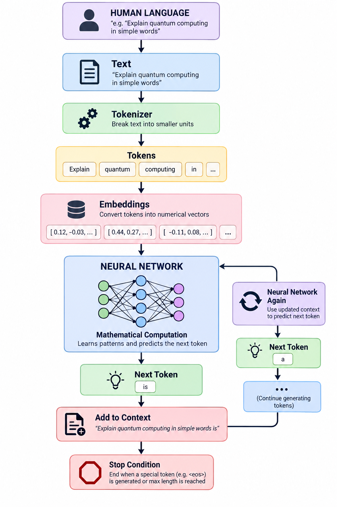

<div align="center">

# The Computational Brain of Machines

</div>

<div style="display: flex; justify-content: space-between;">

<a href="../episode-05/README.md">← Previous Episode</a>
&nbsp;&nbsp;&nbsp;&nbsp;&nbsp;&nbsp;&nbsp;&nbsp;&nbsp;&nbsp;&nbsp;&nbsp;&nbsp;&nbsp;&nbsp;&nbsp;&nbsp;&nbsp;&nbsp;&nbsp;&nbsp;&nbsp;&nbsp;&nbsp;&nbsp;&nbsp;&nbsp;&nbsp;&nbsp;&nbsp;&nbsp;&nbsp;&nbsp;&nbsp;&nbsp;&nbsp;&nbsp;&nbsp;&nbsp;&nbsp;&nbsp;&nbsp;&nbsp;&nbsp;&nbsp;&nbsp;&nbsp;&nbsp;&nbsp;&nbsp;&nbsp;&nbsp;&nbsp;&nbsp;&nbsp;&nbsp;&nbsp;&nbsp;&nbsp;&nbsp;&nbsp;&nbsp;&nbsp;&nbsp;&nbsp;&nbsp;&nbsp;&nbsp;&nbsp;&nbsp;&nbsp;&nbsp;&nbsp;&nbsp;&nbsp;&nbsp;&nbsp;&nbsp;&nbsp;&nbsp;&nbsp;&nbsp;&nbsp;&nbsp;&nbsp;&nbsp;&nbsp;&nbsp;&nbsp;&nbsp;&nbsp;&nbsp;&nbsp;&nbsp;&nbsp;&nbsp;&nbsp;&nbsp;&nbsp;&nbsp;&nbsp;&nbsp;&nbsp;&nbsp;&nbsp;&nbsp;&nbsp;&nbsp;&nbsp;&nbsp;&nbsp;&nbsp;&nbsp;&nbsp;&nbsp;&nbsp;&nbsp;&nbsp;&nbsp;&nbsp;&nbsp;&nbsp;&nbsp;&nbsp;&nbsp;&nbsp;&nbsp;&nbsp;&nbsp;&nbsp;&nbsp;&nbsp;&nbsp;&nbsp;&nbsp;&nbsp;&nbsp;&nbsp;&nbsp;&nbsp;&nbsp;&nbsp;&nbsp;&nbsp;&nbsp;&nbsp;&nbsp;&nbsp;&nbsp;&nbsp;&nbsp;&nbsp;&nbsp;&nbsp;&nbsp;&nbsp;&nbsp;&nbsp;&nbsp;&nbsp;&nbsp;&nbsp;&nbsp;&nbsp;&nbsp;&nbsp;&nbsp;&nbsp;&nbsp;&nbsp;&nbsp;&nbsp;
<a href="../episode-07/README.md">Next Episode →</a>

</div>

---

# 🧠 Episode 06 — The Computational Brain of Machines

We humans are pretty smart, right? 😄 We see things, understand them, connect different pieces of information, and then make decisions.

For example, if someone says:

> **"The pizza is..."**

our brain immediately starts thinking about what could come next.

Maybe:

- hot 🍕
- delicious 😋
- tasty 🤤
- cold 🥶
- round ⭕
- cheesy 🧀

Our brain uses everything it has learned to decide what makes the most sense in that situation.

So here comes an interesting question:

> **If humans use their brain to understand and make decisions, what does a machine use to perform similar intelligent tasks?**

This is where **Neural Networks** enter the picture.

---

## 🧠 The Computational Brain of a Machine

A neural network is one of the fundamental building blocks behind modern AI systems. It doesn't think exactly like the human brain. Instead, it performs a huge number of mathematical computations on the information given to it and uses the learned patterns to produce a prediction.
Let's understand this with a simple example.

---

# 🍕 The Pizza Example

Suppose we give an AI model this sentence:

> **"The pizza is ______"**

What should come next?

It could be:

> **hot**

or

> **delicious**

or

> **tasty**

or something completely different.
The model needs to determine which token is the most appropriate continuation based on the context it has received.

But the question is:

> **How does the model make this decision?**

The answer is:

### Neural Network + Learned Parameters + Mathematical Computation

The neural network takes the numerical representation of the input and performs a series of transformations. Eventually, it produces scores for possible next tokens. The model then uses those scores to determine what token should be generated next.

---

# 🔄 Let's Follow the Journey

Remember what we learned in the previous episodes. A sentence doesn't directly enter a neural network as English words.
There is a pipeline.

```text
"The pizza is"
       │
       ▼
    Tokenizer
       │
       ▼
     Tokens
       │
       ▼
   Embeddings
       │
       ▼
  Neural Network
       │
       ▼
 Next-token Scores
       │
       ▼
  Selected Token
```
So, let's walk through it slowly.

---

## 1️⃣ We Start With Text

Our input is:

> **"The pizza is"**

This is something humans can easily understand. But a neural network doesn't directly work with words in the same way humans do. So the first step is to convert the text into tokens.

---

## 2️⃣ Text Becomes Tokens

The tokenizer breaks the sentence into tokens.

For example:

```text
"The pizza is"
```

might become something conceptually like:

```text
["The", "pizza", "is"]
```
The exact tokens depend on the tokenizer. Each token is then represented numerically.

---

## 3️⃣ Tokens Become Embeddings

Each token is converted into a numerical vector called an **embedding**.

Conceptually:

```text
"The"   → [0.12, -0.45, 0.78, ...]
"pizza" → [0.91,  0.23, -0.31, ...]
"is"    → [0.17,  0.66,  0.42, ...]
```
Now the machine is no longer dealing with words directly.It is dealing with numbers.And this is extremely important.

> **Neural networks perform computations on numbers.**

---

# 🧮 4️⃣ Embeddings Enter the Neural Network

Now these numerical representations are passed into the neural network.This is where the real computation begins.The neural network contains many layers and a huge number of learned parameters.

Inside those layers, the model performs mathematical operations such as:

- multiplication
- addition
- matrix operations
- nonlinear transformations
- attention-related computations
- probability calculations

All of these operations help transform the input representation into something the model can use for prediction.

Conceptually:

```text
Embeddings
    │
    ▼
┌─────────────────────┐
│                     │
│   Neural Network    │
│                     │
│  Mathematical       │
│  Computations       │
│                     │
└─────────────────────┘
    │
    ▼
Prediction
```

---

# 🎯 5️⃣ The Model Predicts the Next Token

After passing through the neural network, the model produces scores for a large vocabulary of possible tokens.

For our example:

```text
Input:
"The pizza is"
```

The model might assign probabilities such as:

```text
hot          → 0.35
delicious    → 0.25
tasty        → 0.18
cold         → 0.05
round        → 0.03
...
```

These numbers are only an illustration.The actual model may consider thousands or even hundreds of thousands of possible tokens.

The important idea is:

> **The neural network doesn't directly say "I know the answer is hot."**

Instead, it computes a distribution of possible next tokens based on the patterns it learned during training.

---

# 🔁 6️⃣ The Story Doesn't End There

Suppose the model selects:

> **"hot"**

Now our sentence becomes:

> **"The pizza is hot"**

But we're not finished.The newly generated token becomes part of the context for the next prediction. So the model runs again.

```text
"The pizza is"
       │
       ▼
   Neural Network
       │
       ▼
     "hot"
```

Then:

```text
"The pizza is hot"
       │
       ▼
   Neural Network
       │
       ▼
     Next Token
```

And again:

```text
"The pizza is hot and"
       │
       ▼
   Neural Network
       │
       ▼
     Next Token
```

And again...

```text
"The pizza is hot and delicious"
       │
       ▼
   Neural Network
       │
       ▼
     Next Token
```

This process keeps repeating.

---

# 🔄 The Generation Loop

We can visualize the whole process like this:

<p align="center">
  <a href="./images/2.png">
    
  </a>
  <p align="center">
    <em>diagram</em>
  </p>
</p>

So an AI model can generate a sentence **one token at a time**.

---

# 🧠 But Why Call It a "Computational Brain"?

Now we can understand why the analogy is useful. When we humans receive information, our brain processes it and helps us decide what to do next.Similarly, an AI model receives numerical representations of information, processes them through its neural network, and produces a prediction.

But remember:

> ⚠️ **A neural network is not literally a human brain.**

The analogy helps us understand the role it plays in the system.A human brain consists of biological neurons and incredibly complex biological processes.An artificial neural network consists of mathematical operations and learned parameters running on computer hardware.The mechanism is completely different.The interesting part is that both systems can transform information and produce useful decisions or predictions.

---

# 🛑 When Does Generation Stop?

There is one final question.If the model keeps predicting the next token, **when does it stop?** There has to be some termination logic. One common mechanism is a special token that represents the **end of a sequence**.

Conceptually:

```text
The pizza is hot and delicious <EOS>
```
When the model generates the appropriate end-of-sequence signal, generation can stop. In real LLM systems, there can also be other stopping conditions, such as:
- reaching a maximum number of tokens
- application-defined stop sequences
- generation limits
- other runtime constraints

So the complete process is not simply:

> **Predict → Predict → Predict forever**

It is:

> **Predict → Add token → Predict again → Continue until a stopping condition is reached.**

---

# 🚀 The Big Picture

Let's connect everything we've learned so far.


<p align="center">
  <a href="./images/1.png">
    
  </a>
  <p align="center">
    <em>diagram</em>
  </p>
</p>


And this brings us to one of the most important ideas in modern AI:

> ### **An LLM generates language by repeatedly predicting what token should come next.**

The magic isn't that the machine somehow "knows" the next word like a human consciously knows it. Underneath the hood, there is an enormous amount of **mathematics, learned parameters, and computation** happening inside the neural network.

And that raises our next big question:

> **What exactly is happening inside the neural network when it receives these embeddings?**

That's where things get really interesting.

### 🔥 Next, we go inside the neural network.